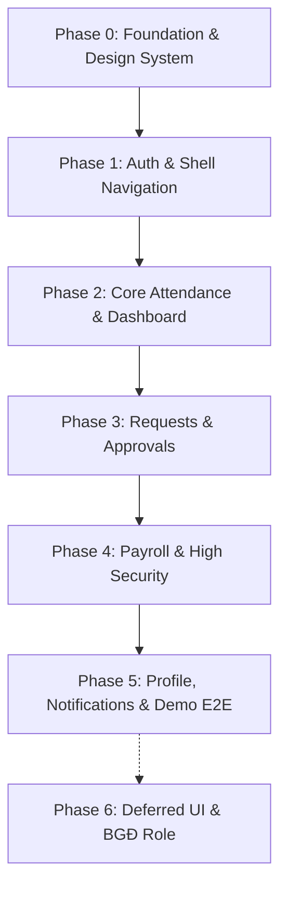

# Implementation Roadmap — vstech-hrm Mobile App

Tài liệu này xác định lộ trình phân kỳ triển khai (Phasing) cho ứng dụng vstech-hrm Mobile (Employee App), phục vụ mục tiêu **Demo hoàn chỉnh luồng nghiệp vụ** và sẵn sàng kết nối API thật.

---

## 1. Nguyên tắc triển khai

1. **Ưu tiên Demo độc lập (Standalone Demo)**:
   - Frontend không chờ Backend API thật. Xây dựng hệ thống **Mock Data / Mock Interceptor** ngay từ Phase 0 để toàn bộ màn hình, biểu mẫu, chuyển trang, và nghiệp vụ đều tương tác được 100%.
   - Chuyển đổi giữa chế độ Mock và Backend thật qua biến môi trường `USE_MOCK_DATA=true/false`.
2. **Hai môi trường duy nhất**:
   - Chỉ duy trì 2 môi trường: **`dev`** (phát triển/thử nghiệm) và **`prod`** (sản phẩm phát hành). Bỏ qua môi trường `staging`.
3. **Phạm vi vai trò ở Phase 0**:
   - Chỉ hỗ trợ **2 vai trò**: **Nhân viên (NV / ESS)** và **Quản lý trực tiếp (QL / MSS)**.
   - Vai trò **Ban Giám Đốc (BGĐ / C-Level)** tạm hoãn ở giai đoạn này, sẽ triển khai cùng các màn hình điều hành ở Phase sau.
4. **Xử lý các chức năng chưa có UI**:
   - 3 chức năng P0 (#1 Referral, #2 Pre-onboarding, #8 Lịch ca riêng biệt) được ghi nhận và **tạm hoãn xây dựng giao diện**; sẽ tiến hành code ngay khi người dùng cung cấp thiết kế UI.
5. **Kỷ luật chất lượng**:
   - Clean Architecture feature-first, tuân thủ giới hạn **≤ 300 dòng/file**, BLoC/Cubit, font Source Sans 3, icon Material Symbols, hoạ văn gạch bông bằng `CustomPainter`.

---

## 2. Lộ trình Phân kỳ Chi tiết

---

### Phase 0: Foundation, Core Architecture & Mock Engine
**Mục tiêu**: Xây dựng khung xương dự án, Design System chuẩn Gạch bông, và nền tảng Mock Data để phục vụ demo.

- [ ] **Scaffold dự án Flutter**: Cấu hình Android `minSdkVersion 26`, iOS `14.0+`, package name, cấu hình lint `very_good_analysis`.
- [ ] **Cấu trúc Clean Architecture Core**:
  - `core/theme`: Token màu `AppColors` (ThemeExtension), Type scale `AppTextStyles` (Source Sans 3), `TilePatternPainter` (CustomPainter hoạ văn gạch bông).
  - `core/network`: Cấu hình `DioClient`, `AuthInterceptor`, `LoggingInterceptor` (chỉ bật ở `dev`), và **`MockDioInterceptor`** nạp JSON mẫu cho chế độ demo.
  - `core/di`: Cấu hình Service Locator với `GetIt`.
  - `core/router`: Cấu hình `go_router`, route constants, route guards theo vai trò.
  - `core/errors`: Định nghĩa hệ thống `Failure` và `Exception`.
  - `core/widgets`: Bộ widget cơ bản dùng chung (Nút chính, Nút phụ, Amber CTA duy nhất, Thẻ Card, InputField, StatusChip, BottomSheet).
- [ ] **Quản lý môi trường**: Cấu hình `.env.dev` và `.env.prod`, hỗ trợ cờ `USE_MOCK_DATA`.

---

### Phase 1: Authentication & Navigation Shell
**Mục tiêu**: Hoàn thiện luồng đăng nhập, ràng buộc thiết bị (mock), và cấu trúc điều hướng 2 vai trò.

- [ ] **Màn hình Splash (`01 splash`)**: Hiệu ứng khởi động, kiểm tra phiên đăng nhập.
- [ ] **Màn hình Đăng nhập (`02 login`)**: Form đăng nhập mã NV + mật khẩu, validate bằng `formz`, tích hợp chọn nhanh tài khoản mẫu (Demo NV / Demo QL).
- [ ] **Device Binding & Session**: Lưu trữ token bảo mật (`flutter_secure_storage`), quản lý trạng thái phiên (`AuthCubit`).
- [ ] **Navigation Shell (`ShellRoute`)**:
  - Bottom navigation bar 5 tab tự động hoán đổi theo vai trò:
    - **Nhân viên (NV)**: Trang chủ · Chấm công · Yêu cầu · Bảng lương · Cá nhân.
    - **Quản lý (QL)**: Trang chủ (+ dải chờ duyệt) · Chấm công · Phê duyệt (+ badge) · Bảng lương · Cá nhân.
- [ ] **Bảo mật sinh trắc học cục bộ (`local_auth`)**: Khóa app/mở khoá nhanh bằng Face ID / Fingerprint.

---

### Phase 2: Personal Dashboard & Core Attendance
**Mục tiêu**: Trải nghiệm cốt lõi của ứng dụng HRM — Chấm công và Bảng điều khiển cá nhân.

- [ ] **Personal Dashboard**:
  - `03 home` (Nhân viên): Thông tin cá nhân, trạng thái công hôm nay, ca làm việc, nút Chấm công nhanh, tóm tắt phép/đơn chờ duyệt, số liệu lương che mặc định (`•••••••• ₫`).
  - `04 home` (Quản lý): Bổ sung dải "Chờ duyệt" nổi bật ưu tiên thao tác nhanh.
- [ ] **Quét khuôn mặt AI (`07 facescan`)**:
  - Giao diện 3 bước: Căn khung mặt (`frame`) → Nhận diện liveness (`recognise`) → Xác thực thành công (`verified`).
  - Preview camera (`camera`), mô phỏng lấy toạ độ GPS (`geolocator`) và BSSID Wi-Fi (`network_info_plus`), kèm đường thoát thủ công khi gặp sự cố.
- [ ] **Lịch sử chấm công (`06 attendance`)**: Tra cứu công theo Ngày / Tuần / Tháng, xem giờ in/out, ảnh đối soát, số phút trễ/sớm.
- [ ] **Bảng công tháng (`08 calendar`) & Ngày lễ (`09 holidays`)**: Lịch tháng trực quan với 5 mã màu chuẩn hoá (đủ công, muộn/sớm, thiếu công, nghỉ phép, ngày nghỉ).
- [ ] **Điều chỉnh công & Giải trình (`13 correction`)**: Luồng 3 bước (chọn ngày phát sinh → chọn vấn đề → nhập giải trình & đính kèm minh chứng).

---

### Phase 3: Leave, Overtime & Request Center
**Mục tiêu**: Số hoá quy trình tạo đơn từ và luân chuyển phê duyệt đa cấp.

- [ ] **Quản lý số dư phép (`11 leave`)**: Thống kê phép năm, phép bệnh, việc riêng; thanh tiến độ số ngày khả dụng.
- [ ] **Đơn xin nghỉ phép (`11 leave`)**: Chọn loại nghỉ, chọn ngày (cả ngày/nửa ca), người bàn giao, validate inline và cảnh báo trùng lịch local-cache.
- [ ] **Đăng ký Tăng ca (`12 overtime`)**: Đăng ký ca OT, tự tính tổng giờ và hệ số lương (150%/200%/300%), lịch sử tăng ca cùng màn.
- [ ] **Trung tâm yêu cầu hợp nhất (`10 requests`)**:
  - Gom toàn bộ đơn: nghỉ phép, tăng ca, giải trình công, khiếu nại lương.
  - Tab lọc theo loại và trạng thái (Pending/Approved/Rejected/Cancelled).
  - Chi tiết đơn hiển thị thanh tiến độ chuẩn 4 bước: `Nhân viên gửi → Quản lý duyệt → HR xác nhận → Giám đốc phê duyệt`.
- [ ] **Hộp thư phê duyệt Quản lý (`21 approvals`)**:
  - Danh sách đơn cấp dưới chờ duyệt theo thời gian thực.
  - Thao tác 1-chạm: Approve nhanh, Reject (kèm modal lý do bắt buộc), nhập bình luận trao đổi.

---

### Phase 4: Payroll, Bonus & High Security
**Mục tiêu**: Xử lý dữ liệu tài chính nhạy cảm với cơ chế bảo mật cao cấp.

- [ ] **Bảo vệ an ninh màn lương**:
  - Bắt buộc xác thực sinh trắc học cục bộ (`local_auth`) trước khi mở màn lương.
  - Kích hoạt `screen_protector` chống chụp và quay màn hình.
- [ ] **Tổng quan thu nhập (`14 payroll`)**: Cơ cấu lương theo hợp đồng, hiển thị lương thực nhận (Net), các khoản phụ cấp và trích nộp.
- [ ] **Phiếu lương chi tiết e-Payslip (`15 payslip`)**:
  - Bóc tách chi tiết ngày công thực tế, phụ cấp, tiền OT, giảm trừ thuế TNCN, BHXH/BHYT/BHTN.
  - Ký số xác nhận bảng lương hàng tháng trên di động.
  - Tiếp nhận khiếu nại sai lệch trực tiếp từ phiếu lương.
- [ ] **Thưởng doanh số & Hoa hồng (`16 bonus`)**:
  - Theo dõi tiền hoa hồng tích luỹ theo giao dịch/tháng.
  - Thanh tiến độ tỷ lệ đạt chỉ tiêu và bảng ước tính mức thưởng tương ứng.

---

### Phase 5: Profile, Notifications & Demo Ready
**Mục tiêu**: Hoàn thiện hồ sơ cá nhân, thông báo và đóng gói toàn bộ luồng demo.

- [ ] **Hồ sơ nhân viên 360° (`20 profile`)**: Thông tin cá nhân, thông tin công việc, sơ đồ tổ chức, hợp đồng lao động.
- [ ] **Trung tâm thông báo (`19 notifications`)**: Danh sách thông báo chia nhóm (Công ty / Đơn từ / Chấm công / Lương), đánh dấu đã đọc, deep-link tới đơn/màn hình tương ứng.
- [ ] **Cài đặt ứng dụng (`24 settings`)**: Đổi ngôn ngữ (Việt / Anh), chuyển theme (Sáng / Tối), cài đặt sinh trắc học và mã PIN dự phòng.
- [ ] **Trạng thái hệ thống**: Hoàn thiện bộ màn hình dùng chung (`25 empty`, `26 loading`, `27 error`).
- [ ] **Tổng duyệt Demo (E2E Polish)**:
  - Kiểm tra mượt mà cả 2 kịch bản: **Nhân viên** (Chấm công → Tạo đơn → Xem bảng lương) và **Quản lý** (Nhận thông báo → Xem dải chờ duyệt → Phê duyệt đơn).

---

### Phase 6: Backlog & Deferred Items (Hạng mục triển khai sau)
**Mục tiêu**: Bổ sung khi có thiết kế UI hoặc khi backend sẵn sàng.

1. **3 Chức năng P0 chưa có UI (chờ thiết kế)**:
   - *#1 Giới thiệu nhân tài nội bộ (Referral)*: Xem vị trí tuyển dụng, link/mã QR giới thiệu, nhập ứng viên, theo dõi hoa hồng.
   - *#2 Tiếp nhận nhân sự số hoá (Pre-onboarding)*: Luồng dành cho ứng viên trúng tuyển, nộp hồ sơ CCCD, ký NDA điện tử.
   - *#8 Lịch làm việc & Ca trực cá nhân (Shift Scheduling tách riêng)*: Màn hình chuyên biệt xem phân ca tuần/tháng nếu tách khỏi Calendar.
2. **Vai trò Ban Giám Đốc (BGĐ)**:
   - *#22 exec*: Bảng điều hành C-level.
   - *#23 final*: Phê duyệt cuối cấp Giám đốc.
3. **Chấm công ngoại tuyến (Offline Queue)**:
   - Hàng đợi local SQLite/Drift tự động đồng bộ khi có mạng (đã hoãn từ đầu).
4. **Tích hợp Backend Production**:
   - Chuyển `USE_MOCK_DATA=false`, kết nối API thật khi Backend hoàn thiện OpenAPI.

---

## 3. Bảng phân công Chức năng P0 ↔ Giai đoạn (Phase)

| Chức năng P0 | Tên chức năng | Phase thực hiện | Trạng thái UI |
| :---: | :--- | :---: | :--- |
| **#1** | Giới thiệu nhân tài nội bộ (Referral) | **Phase 6** | *Chờ người dùng cung cấp UI* |
| **#2** | Tiếp nhận nhân sự số hoá (Pre-onboarding) | **Phase 6** | *Chờ người dùng cung cấp UI* |
| **#3** | Chấm công Nhận diện khuôn mặt AI | **Phase 2** | Có sẵn (`07 facescan`) |
| **#4** | Chấm công ngoại tuyến (Offline queue) | *Đã hoãn* | Không build |
| **#5** | Lịch sử chấm công chi tiết | **Phase 2** | Có sẵn (`06 attendance`) |
| **#6** | Bảng công lịch tháng trực quan | **Phase 2** | Có sẵn (`08 calendar`, `09 holidays`) |
| **#7** | Điều chỉnh công & Giải trình ngoại lệ | **Phase 2** | Có sẵn (`13 correction`) |
| **#8** | Lịch làm việc & Ca trực cá nhân | **Phase 2 / 6** | Ca hôm nay có ở `home`; lịch ca riêng chờ UI |
| **#9** | Quản lý số dư phép | **Phase 3** | Có sẵn (`11 leave`) |
| **#10** | Đăng ký & Lịch sử nghỉ phép / Tăng ca | **Phase 3** | Có sẵn (`11 leave`, `12 overtime`) |
| **#11** | Tổng quan lương, e-Payslip, Ký số, Khiếu nại | **Phase 4** | Có sẵn (`14 payroll`, `15 payslip`) |
| **#12** | Tra cứu thưởng doanh số & hoa hồng | **Phase 4** | Có sẵn (`16 bonus`) |
| **#13** | Dashboard tự phục vụ (Personal Dashboard) | **Phase 2** | Có sẵn (`03 home`, `04 home QL`) |
| **#14** | Hộp thư phê duyệt Cấp Quản lý | **Phase 3** | Có sẵn (`21 approvals`) |
| **#15** | Trung tâm quản lý đơn từ hợp nhất | **Phase 3** | Có sẵn (`10 requests`) |
| **#16** | Trung tâm Thông báo & Push Notification | **Phase 5** | Có sẵn (`19 notifications`) |
| **#17** | Hồ sơ nhân viên 360° | **Phase 5** | Có sẵn (`20 profile`) |
| **#18** | Bảo mật tài khoản & Ràng buộc thiết bị | **Phase 1** | Có sẵn (`24 settings` & Auth) |
