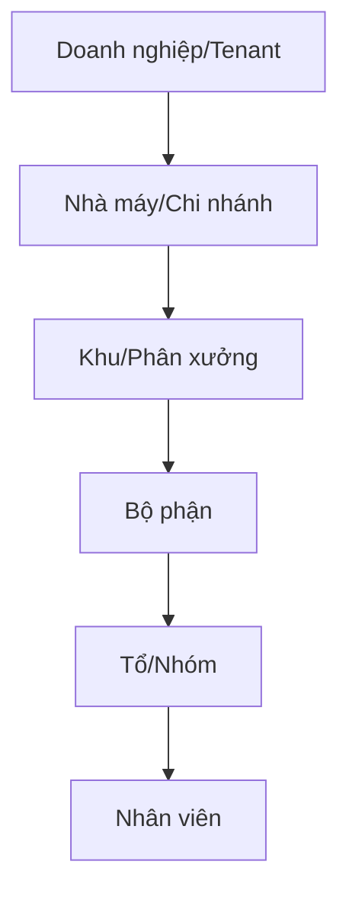
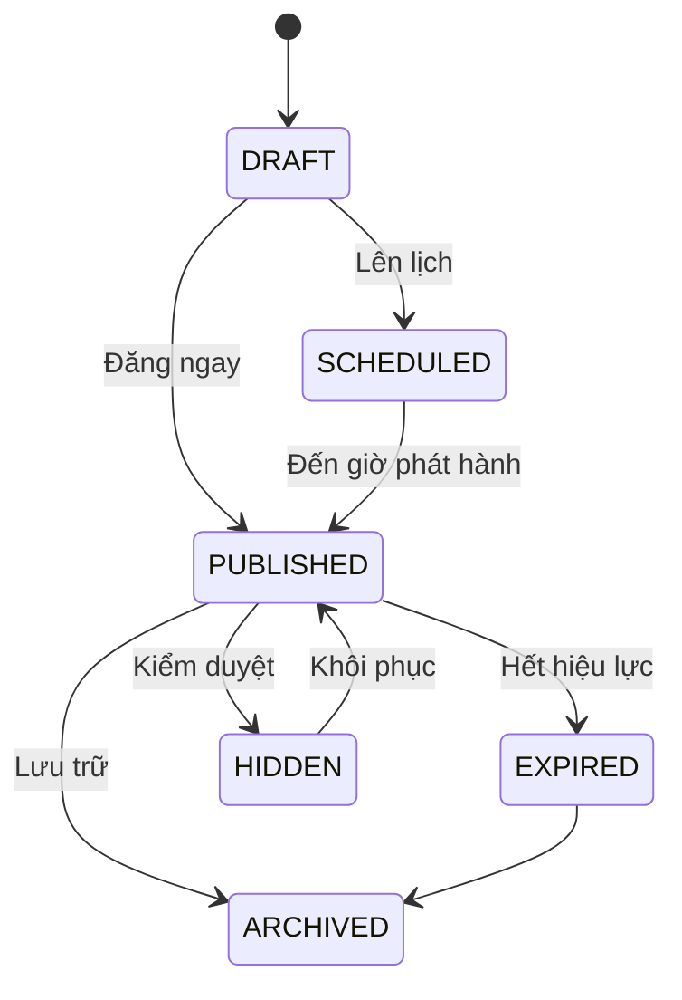
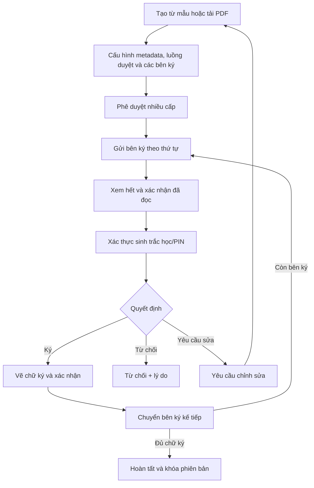
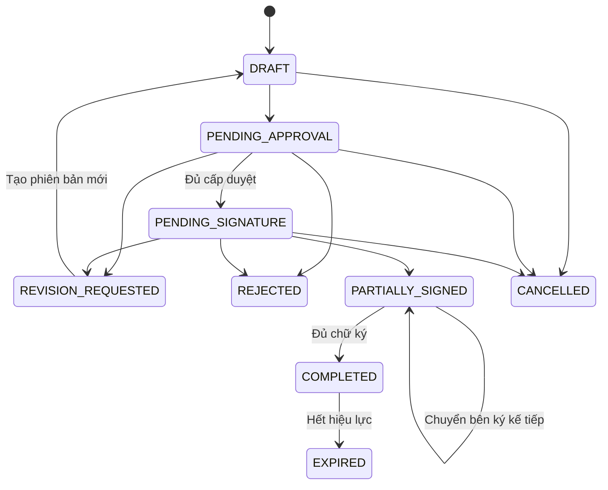
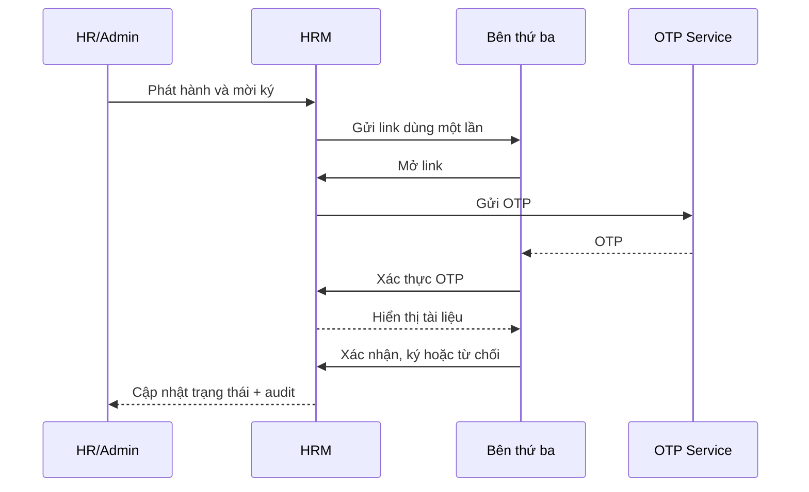
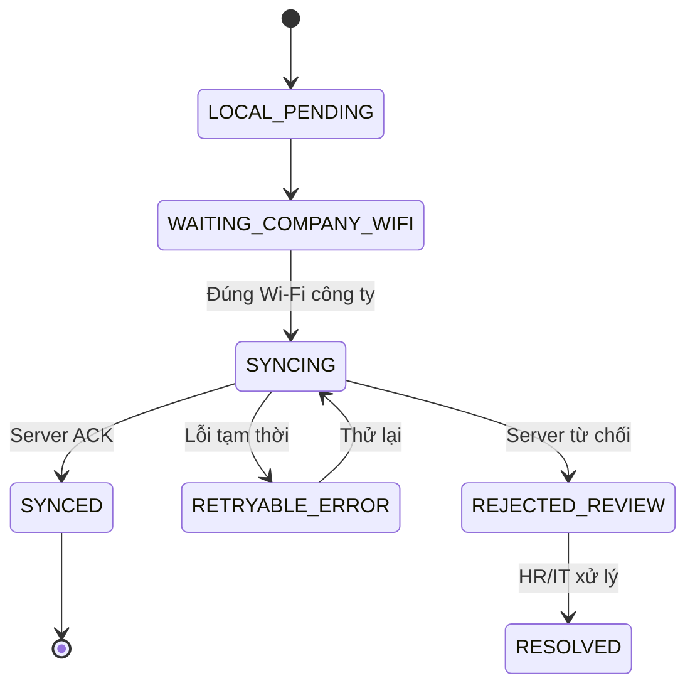
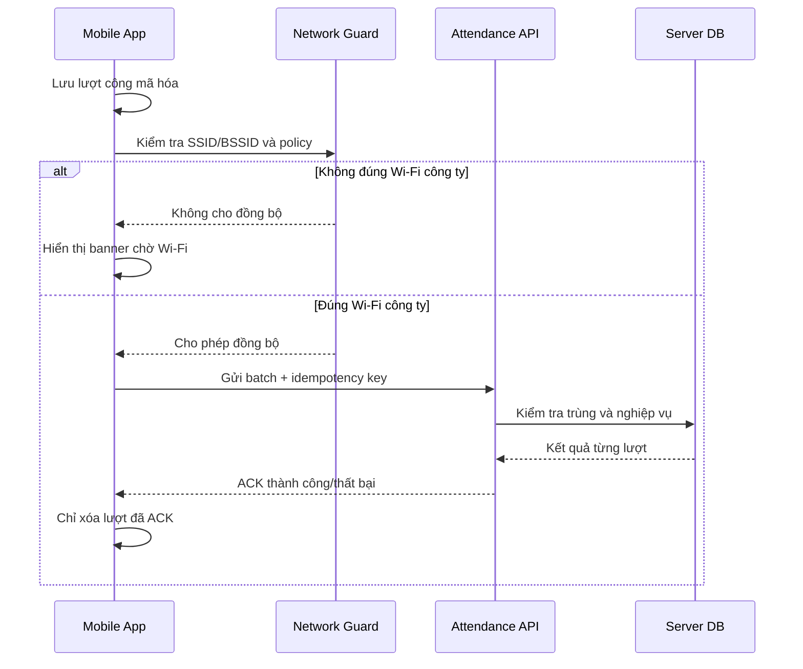

# BÁO CÁO BỔ SUNG CHỨC NĂNG P0

## Nền tảng quản trị nguồn nhân lực HRM Mobile

> Tài liệu đặc tả chi tiết cho bốn nhóm chức năng bổ sung vào P0: **Cộng đồng nội bộ**, **Hợp đồng điện tử**, **Cảnh báo chấm công ngoại tuyến chưa gửi** và **Tổng hợp công theo ca trong tuần của tổ/nhóm**.

---

## Thông tin tài liệu

| Thuộc tính | Giá trị |
|---|---|
| Tên tài liệu | Báo cáo bổ sung chức năng P0 - Nền tảng HRM Mobile |
| Phiên bản | 1.0 |
| Trạng thái | Business requirements baseline |
| Ngày cập nhật | 22/09/2026 |
| Nền tảng | Flutter Android, Flutter iOS và Web quản trị |
| Loại hình ưu tiên | Nhà máy - xí nghiệp |
| Quy mô tham chiếu | Khoảng 3.000 nhân sự |
| Mô hình sản phẩm | B2B SaaS đa doanh nghiệp |
| Ưu tiên | P0 - Must Have |
| Tài liệu nguồn | Danh sách chức năng HRM theo ưu tiên v2 BGD |

## Lịch sử phiên bản

| Phiên bản | Ngày | Nội dung |
|---|---:|---|
| 1.0 | 22/09/2026 | Khởi tạo đặc tả chi tiết cho bốn nhóm chức năng P0 |

---

# Mục lục

1. [Tóm tắt điều hành](#1-tóm-tắt-điều-hành)
2. [Phạm vi hệ thống P0](#2-phạm-vi-hệ-thống-p0)
3. [Vai trò và phân quyền](#3-vai-trò-và-phân-quyền)
4. [Điều hướng và Dashboard Mobile](#4-điều-hướng-và-dashboard-mobile)
5. [Cộng đồng nội bộ chính thức](#5-cộng-đồng-nội-bộ-chính-thức)
6. [Hợp đồng điện tử](#6-hợp-đồng-điện-tử)
7. [Cảnh báo chấm công ngoại tuyến chưa gửi](#7-cảnh-báo-chấm-công-ngoại-tuyến-chưa-gửi)
8. [Tổng hợp công theo ca trong tuần](#8-tổng-hợp-công-theo-ca-trong-tuần)
9. [Ma trận hoạt động ngoại tuyến](#9-ma-trận-hoạt-động-ngoại-tuyến)
10. [Yêu cầu tích hợp và API tham chiếu](#10-yêu-cầu-tích-hợp-và-api-tham-chiếu)
11. [Yêu cầu phi chức năng](#11-yêu-cầu-phi-chức-năng)
12. [Analytics và giám sát vận hành](#12-analytics-và-giám-sát-vận-hành)
13. [Kế hoạch kiểm thử và nghiệm thu](#13-kế-hoạch-kiểm-thử-và-nghiệm-thu)
14. [Các quyết định mở và rủi ro](#14-các-quyết-định-mở-và-rủi-ro)
15. [Phạm vi hoàn thành P0](#15-phạm-vi-hoàn-thành-p0)
16. [Thuật ngữ](#16-thuật-ngữ)

---

# 1. Tóm tắt điều hành

## 1.1. Mục tiêu

Bổ sung bốn nhóm chức năng thiết yếu vào P0 nhằm đáp ứng nhu cầu vận hành thực tế của doanh nghiệp sản xuất có khoảng 3.000 nhân sự, tổ chức theo khu, phân xưởng, tổ và nhóm:

1. Cộng đồng nội bộ chính thức toàn công ty.
2. Quản lý vòng đời và ký hợp đồng điện tử.
3. Cảnh báo và quản lý lượt chấm công ngoại tuyến chưa gửi.
4. Tổng hợp công theo ca trong tuần cho quản lý.

## 1.2. Tác động lên danh sách chức năng P0

| STT | Phân hệ | Bổ sung/điều chỉnh | Quan hệ với danh sách hiện tại | Ưu tiên |
|---:|---|---|---|:---:|
| 1 | Truyền thông | Cộng đồng nội bộ chính thức có bình luận và tương tác | Chuyển lõi “Bảng tin doanh nghiệp” từ P1 xuống P0 | P0 |
| 2 | Hợp đồng | Quản lý vòng đời và ký hợp đồng điện tử | Bổ sung chức năng độc lập; liên kết Hồ sơ và Tài liệu | P0 |
| 3 | Chấm công | Banner và hàng đợi chấm công ngoại tuyến chưa gửi | Mở rộng chức năng P0 #4; không tăng số chức năng cấp cao | P0 |
| 4 | Quản lý | Tổng hợp công theo ca tuần của tổ/nhóm | Đưa phạm vi rút gọn của Team Overview xuống P0 | P0 |

### Kết quả đếm chức năng

- P0 ban đầu: **25 chức năng cấp cao**.
- Chức năng độc lập bổ sung/chuyển xuống P0: **03**.
- Chức năng #4 được mở rộng nhưng không tách thành chức năng cấp cao mới: **01**.
- Tổng chức năng cấp cao P0 sau bổ sung: **28**.

## 1.3. Nguyên tắc phạm vi P0

- Chức năng P0 phải đủ dùng trong vận hành thật, không chỉ là màn hình minh họa.
- Mobile ưu tiên tra cứu nhanh, tác nghiệp cá nhân, phê duyệt và xử lý tại hiện trường.
- Web ưu tiên cấu hình, tạo nội dung, vận hành hàng loạt, xếp ca và báo cáo diện rộng.
- Một ứng dụng Mobile dùng chung cho mọi vai trò.
- Tài khoản chỉ có một business role tại một thời điểm.
- Quyền chi tiết được cấu hình theo từng khách hàng doanh nghiệp.
- Tất cả dữ liệu bắt buộc được phân vùng theo tenant.
- Mọi thao tác nhạy cảm phải có audit log.

---

# 2. Phạm vi hệ thống P0

## 2.1. Thông tin nền tảng

| Hạng mục | Quyết định P0 | Ghi chú |
|---|---|---|
| Mô hình | B2B SaaS đa doanh nghiệp | Mỗi khách hàng là một tenant độc lập |
| Ngành ưu tiên | Nhà máy - xí nghiệp | Khoảng 3.000 nhân sự |
| Cơ cấu | Khu, phân xưởng, bộ phận, tổ/nhóm | Cho phép cấu hình theo khách hàng |
| Mobile | Flutter Android và iOS | Một codebase, kiểm soát khác biệt nền tảng |
| Web | Có trong P0 | Quản trị, cấu hình và tác nghiệp hàng loạt |
| Ngôn ngữ | Tiếng Việt và Tiếng Anh | Nhãn hệ thống dùng resource đa ngôn ngữ |
| Đăng nhập | Tài khoản trả về role và permission | UI được dựng theo permission |
| Role | Một role/tài khoản tại một thời điểm | Không hỗ trợ nhiều role đồng thời trong P0 |
| Quản lý | Có thể quản lý nhiều tổ/khu/chi nhánh | Phạm vi được áp dụng qua bộ lọc và permission |

## 2.2. Cấu trúc tổ chức tham chiếu



### Quy tắc

- Cây tổ chức có thể sâu hơn hoặc nông hơn tùy doanh nghiệp.
- Tên cấp tổ chức phải cấu hình được.
- Quản lý có thể được gán phạm vi tại một hoặc nhiều node.
- Permission dữ liệu được xác định từ role, node tổ chức và quyền bổ sung.
- Bộ lọc trên Mobile chỉ hiển thị phạm vi người dùng được phép truy cập.

## 2.3. Ranh giới Mobile và Web

| Nghiệp vụ | Mobile | Web |
|---|---|---|
| Community | Đọc, tìm kiếm, tương tác, bình luận, báo cáo | Soạn bài, đăng, lên lịch, ghim, kiểm duyệt, thống kê |
| Hợp đồng | Xem, duyệt theo quyền, yêu cầu sửa, từ chối, ký, tải | Tạo/tải tài liệu, cấu hình luồng, quản lý hàng loạt |
| Chấm công ngoại tuyến | Lưu hàng đợi, cảnh báo, đồng bộ, xem lỗi | Theo dõi tồn đọng, cấu hình ngưỡng, xử lý ngoại lệ |
| Tổng hợp ca | Xem, lọc, drill-down, xuất/chia sẻ | Xếp ca, sửa ca, cấu hình loại ca và tuần làm việc |

---

# 3. Vai trò và phân quyền

## 3.1. Vai trò mặc định

| Mã | Vai trò | Mô tả |
|---|---|---|
| `EMPLOYEE` | Nhân viên | Tự phục vụ, chấm công, đọc thông tin, xử lý hợp đồng cá nhân |
| `TEAM_LEAD` | Tổ trưởng/Quản lý ca | Theo dõi tổ, xem tổng hợp ca, xử lý phạm vi được giao |
| `MANAGER` | Quản lý trực tiếp | Quản lý nhiều tổ/đơn vị và phê duyệt |
| `REGIONAL_MANAGER` | Quản lý vùng | Xem nhiều khu/nhà máy/chi nhánh qua bộ lọc |
| `HR_ADMIN` | HR/Admin | Quản trị nội dung, hợp đồng và báo cáo nhân sự |
| `C_LEVEL` | C-level | Phê duyệt cuối và xem báo cáo theo phạm vi |

> Tên và tập quyền của role có thể được doanh nghiệp khách hàng cấu hình lại.

## 3.2. Nguyên tắc cấp quyền

1. Role cung cấp tập quyền mặc định.
2. Permission chi tiết mới quyết định hành động cuối cùng.
3. Phạm vi dữ liệu được giới hạn theo tenant và cây tổ chức.
4. Không cấp quyền xem toàn bộ hợp đồng chỉ dựa trên chức danh.
5. C-level chỉ xem hợp đồng trong phạm vi được cấp.
6. Quản lý chỉ xem hợp đồng cần họ phê duyệt, trừ khi có quyền bổ sung.
7. Mọi quyền đặc biệt phải có thời hạn hoặc audit log nếu doanh nghiệp yêu cầu.

## 3.3. Permission đề xuất

### Community

- `community.post.view`
- `community.post.create`
- `community.post.edit`
- `community.post.delete`
- `community.post.pin`
- `community.post.schedule`
- `community.comment.create`
- `community.comment.edit_own`
- `community.comment.delete_own`
- `community.content.moderate`
- `community.report.create`
- `community.read_receipt.summary`

### Hợp đồng

- `contract.view_own`
- `contract.view_assigned`
- `contract.view_summary`
- `contract.view_all`
- `contract.create`
- `contract.configure_workflow`
- `contract.approve`
- `contract.final_approve`
- `contract.sign`
- `contract.reject`
- `contract.request_revision`
- `contract.cancel`
- `contract.download`
- `contract.remind`
- `contract.audit.view`

### Chấm công ngoại tuyến

- `attendance.offline.view_own`
- `attendance.offline.sync_own`
- `attendance.offline.team_view`
- `attendance.offline.admin_view`
- `attendance.offline.override_logout`
- `attendance.offline.resolve_error`

### Tổng hợp ca

- `shift.summary.team_view`
- `shift.summary.multi_level_view`
- `shift.summary.cross_location_view`
- `shift.summary.export_pdf`
- `shift.summary.export_excel`

## 3.4. Ma trận quyền mặc định

| Chức năng | Nhân viên | Quản lý | HR/Admin | C-level |
|---|---|---|---|---|
| Community | Xem và tương tác | Xem và tương tác | Tạo, quản trị, kiểm duyệt | Xem; đăng nếu được cấp quyền |
| Hợp đồng | Hợp đồng của mình | Hợp đồng cần duyệt | Theo phạm vi HR | Theo quyền/phạm vi |
| Công ngoại tuyến | Hàng đợi của mình | Bản thân và đội ngũ | Toàn phạm vi được cấp | Báo cáo nếu được cấp quyền |
| Tổng hợp ca | Không | Theo cây quản lý | Theo phạm vi HR | Tổng hợp theo quyền |

---

# 4. Điều hướng và Dashboard Mobile

## 4.1. Nguyên tắc điều hướng

- Giữ cấu trúc điều hướng ổn định giữa các role.
- Role chỉ thay đổi nội dung bên trong tab, không thay đổi toàn bộ thói quen sử dụng.
- Hành động cần xử lý được ưu tiên hơn nội dung tham khảo.
- Cảnh báo ảnh hưởng dữ liệu công luôn nằm trên các card thông thường.
- Push notification phải deep link vào đúng màn hình và đúng đối tượng dữ liệu.

## 4.2. Bottom Navigation

| Tab | Mục đích | Nội dung theo role |
|---|---|---|
| Trang chủ | Trung tâm tác nghiệp hằng ngày | Chấm công, ca hôm nay, cảnh báo, việc cần xử lý, Community nổi bật |
| Chấm công | Nghiệp vụ thời gian | Nhân viên xem công/ca; quản lý có thêm tab Đội ngũ |
| Cộng đồng | Bảng tin chính thức | Một feed toàn công ty |
| Yêu cầu | Đơn từ và phê duyệt | Nhân viên xem đơn; quản lý xem hộp thư duyệt |
| Cá nhân | Hồ sơ và tài liệu | Hồ sơ, Hợp đồng, bảo mật và cài đặt |

## 4.3. Dashboard nhân viên

Thứ tự ưu tiên:

1. Banner lượt công ngoại tuyến chưa gửi.
2. Thẻ chấm công và ca hôm nay.
3. Khu vực “Cần xử lý”, ưu tiên hợp đồng chờ ký.
4. Số phép còn lại, tổng công tháng và đơn đang chờ.
5. Tối đa 1-3 bài Community ưu tiên.
6. Lối tắt đến lịch ca, bảng công và hợp đồng.

## 4.4. Dashboard quản lý

Thứ tự ưu tiên:

1. Banner công ngoại tuyến của bản thân.
2. Cảnh báo nhân viên chưa gửi công hoặc thiếu công.
3. Yêu cầu và hợp đồng đang chờ duyệt.
4. Tổng hợp ca tuần của tổ/nhóm.
5. Tối đa 1-3 bài Community ưu tiên.
6. Thẻ chấm công cá nhân của quản lý.

## 4.5. Quy tắc hiển thị card “Cần xử lý”

| Mức | Ví dụ | Cách hiển thị |
|---|---|---|
| Khẩn cấp | Công ngoại tuyến gần khóa công | Banner đỏ, không cho bỏ qua hoàn toàn |
| Cao | Hợp đồng sắp hết hạn ký | Card cảnh báo và push |
| Trung bình | Đơn chờ bổ sung | Card trong nhóm việc cần xử lý |
| Thông tin | Bài Community mới | Card nội dung phía dưới |

---

# 5. Cộng đồng nội bộ chính thức

## 5.1. Mục tiêu

Tạo một kênh phát ngôn chính thức toàn công ty để HR/Admin truyền đạt thông báo, sự kiện và nội dung văn hóa đến khoảng 3.000 nhân sự, đồng thời cho phép tương tác hai chiều có kiểm soát.

## 5.2. Phạm vi P0 đã chốt

- Chỉ có một Community chung toàn công ty.
- Chỉ HR/Admin được tạo bài.
- Nhân viên và quản lý không được đăng bài.
- Hỗ trợ văn bản, hình ảnh, video, PDF, liên kết và khảo sát.
- Có phân loại bài viết.
- Có ghim bài.
- Có lịch đăng và ngày hết hiệu lực.
- Có reaction, bình luận, trả lời bình luận và nhắc tên.
- Dữ liệu bình luận hỗ trợ nhiều cấp.
- UI Mobile hiển thị tối đa hai tầng.
- Người dùng được sửa/xóa bình luận của mình.
- HR/Admin được sửa/xóa bài và kiểm duyệt nội dung.
- Có thể tắt bình luận theo từng bài.
- Không cho phép nội dung ẩn danh.
- Người dùng được báo cáo nội dung.
- Nội dung bị xóa vẫn còn trong audit log.
- Tất cả bài mới đều gửi push.
- Có khung giờ yên lặng.
- Bài khẩn có thể bỏ qua khung giờ yên lặng nếu có quyền.
- Bài bắt buộc đọc có nút xác nhận.
- HR/Admin chỉ cần xem số lượng và tỷ lệ xác nhận trong P0.
- Dashboard hiển thị tối đa 1-3 bài ưu tiên.

## 5.3. Actor

| Actor | Trách nhiệm |
|---|---|
| Nhân viên | Đọc, reaction, bình luận, nhắc tên, báo cáo nội dung, xác nhận đã đọc |
| Quản lý | Có quyền tương tác như nhân viên |
| HR/Admin | Tạo, sửa, đăng, ghim, lên lịch, đóng bình luận và kiểm duyệt |
| C-level | Xem; có thể đăng nếu tenant cấp permission |
| Notification Service | Phát push và deep link |

## 5.4. Danh sách yêu cầu chức năng

| ID | Yêu cầu |
|---|---|
| COM-FR-001 | Hệ thống cung cấp một feed Community chung trong tenant. |
| COM-FR-002 | Chỉ tài khoản có `community.post.create` mới thấy nút tạo bài. |
| COM-FR-003 | Bài viết hỗ trợ rich text ở mức phù hợp Mobile. |
| COM-FR-004 | Bài viết hỗ trợ nhiều ảnh. |
| COM-FR-005 | Bài viết hỗ trợ video hoặc liên kết video theo cấu hình. |
| COM-FR-006 | Bài viết hỗ trợ file PDF. |
| COM-FR-007 | Bài viết hỗ trợ liên kết ngoài có preview an toàn. |
| COM-FR-008 | Bài viết hỗ trợ khảo sát nhanh. |
| COM-FR-009 | HR/Admin chọn loại bài khi tạo. |
| COM-FR-010 | HR/Admin có thể ghim và bỏ ghim bài. |
| COM-FR-011 | HR/Admin có thể đặt thời điểm phát hành. |
| COM-FR-012 | HR/Admin có thể đặt ngày hết hiệu lực. |
| COM-FR-013 | Người dùng có thể reaction theo bộ reaction được cấu hình. |
| COM-FR-014 | Người dùng có thể bình luận và trả lời bình luận. |
| COM-FR-015 | Người dùng có thể nhắc tên người khác trong bình luận. |
| COM-FR-016 | Người dùng được sửa/xóa bình luận của mình. |
| COM-FR-017 | HR/Admin được khóa/mở bình luận của bài. |
| COM-FR-018 | Người dùng được báo cáo bài hoặc bình luận. |
| COM-FR-019 | HR/Admin được ẩn/xóa nội dung vi phạm. |
| COM-FR-020 | Hệ thống lưu audit log của nội dung bị chỉnh sửa/xóa. |
| COM-FR-021 | Bài bắt buộc đọc hiển thị nút “Tôi đã đọc/Đã hiểu”. |
| COM-FR-022 | Hệ thống ghi nhận người xác nhận và hiển thị tỷ lệ tổng hợp cho HR/Admin. |
| COM-FR-023 | Feed hỗ trợ tìm kiếm và lọc theo loại bài/thời gian. |
| COM-FR-024 | Push của bài viết mở đúng bài qua deep link. |
| COM-FR-025 | Dashboard hiển thị tối đa ba bài ưu tiên. |

## 5.5. Phân loại bài viết

| Mã | Loại | Mức ưu tiên mặc định |
|---|---|---|
| `EMERGENCY` | Khẩn cấp | Cao nhất |
| `ANNOUNCEMENT` | Thông báo | Cao |
| `EVENT` | Sự kiện | Bình thường |
| `RECOGNITION` | Vinh danh | Bình thường |
| `INTERNAL_RECRUITMENT` | Tuyển dụng nội bộ | Bình thường |

## 5.6. Trạng thái bài viết



| Trạng thái | Ý nghĩa |
|---|---|
| `DRAFT` | Chưa phát hành |
| `SCHEDULED` | Đã đặt lịch |
| `PUBLISHED` | Đang hiển thị |
| `EXPIRED` | Hết hiệu lực |
| `HIDDEN` | Bị ẩn do kiểm duyệt |
| `ARCHIVED` | Lưu trữ |

## 5.7. Quy tắc sắp xếp Feed

Thứ tự:

1. Bài khẩn cấp còn hiệu lực.
2. Bài được ghim.
3. Bài bắt buộc đọc mà người dùng chưa xác nhận.
4. Bài mới nhất theo thời gian phát hành.

### Business Rules

| ID | Quy tắc |
|---|---|
| COM-BR-001 | Một bài hết hiệu lực không còn xuất hiện trong feed mặc định. |
| COM-BR-002 | Một bài bị ẩn không hiển thị cho người dùng thông thường. |
| COM-BR-003 | Chỉnh sửa bài đã đăng phải ghi nhận phiên bản và người sửa. |
| COM-BR-004 | Xóa nội dung là soft delete trong dữ liệu audit. |
| COM-BR-005 | Một người chỉ được bình chọn một lần cho mỗi câu hỏi khảo sát, trừ khi khảo sát cho phép sửa lựa chọn. |
| COM-BR-006 | Người dùng chỉ được sửa/xóa bình luận của mình. |
| COM-BR-007 | HR/Admin có thể xử lý mọi bình luận trong tenant. |
| COM-BR-008 | Bài bị khóa bình luận vẫn cho phép xem bình luận cũ. |
| COM-BR-009 | Bài bắt buộc đọc phải lưu timestamp xác nhận của từng người. |
| COM-BR-010 | Khung giờ yên lặng không áp dụng cho bài khẩn nếu người đăng có permission tương ứng. |

## 5.8. Bình luận nhiều cấp trên Mobile

### Mô hình dữ liệu

- Bình luận có `parent_comment_id`.
- Backend cho phép nhiều cấp.
- Mỗi thread có một bình luận gốc.
- Phản hồi sâu hơn vẫn nằm trong thread của bình luận gốc.

### Mô hình hiển thị

- Tầng 1: bình luận gốc.
- Tầng 2: tất cả câu trả lời trong thread.
- Phản hồi sâu hiển thị tiền tố `Trả lời @Tên`.
- Không tăng thụt lề sau tầng 2.
- Thread dài được thu gọn và tải thêm theo trang.

## 5.9. Trường dữ liệu chính

### Post

| Trường | Bắt buộc | Mô tả |
|---|:---:|---|
| `id` | Có | Định danh bài |
| `tenant_id` | Có | Tenant sở hữu |
| `type` | Có | Loại bài |
| `title` | Có | Tiêu đề |
| `content` | Có | Nội dung |
| `attachments` | Không | Ảnh, video, PDF, link |
| `is_pinned` | Có | Trạng thái ghim |
| `is_read_ack_required` | Có | Có yêu cầu xác nhận đọc không |
| `comments_enabled` | Có | Cho phép bình luận |
| `publish_at` | Có | Thời gian phát hành |
| `expire_at` | Không | Thời gian hết hiệu lực |
| `status` | Có | Trạng thái bài |
| `created_by` | Có | Người tạo |
| `updated_by` | Có | Người sửa cuối |

### Comment

| Trường | Bắt buộc | Mô tả |
|---|:---:|---|
| `id` | Có | Định danh bình luận |
| `post_id` | Có | Bài viết |
| `parent_comment_id` | Không | Bình luận cha |
| `thread_root_id` | Có | Bình luận gốc của thread |
| `content` | Có | Nội dung |
| `mentions` | Không | Danh sách người được nhắc |
| `created_by` | Có | Người bình luận |
| `edited_at` | Không | Thời gian sửa |
| `deleted_at` | Không | Thời gian soft delete |

## 5.10. Màn hình Mobile

| Mã | Màn hình | Thành phần |
|---|---|---|
| COM-UI-01 | Feed Community | App bar, tìm kiếm, bộ lọc, bài ghim, danh sách bài |
| COM-UI-02 | Chi tiết bài | Nội dung, media, khảo sát, reaction, bình luận |
| COM-UI-03 | Thread bình luận | Bình luận gốc, câu trả lời, composer |
| COM-UI-04 | Báo cáo nội dung | Loại vi phạm và ghi chú |
| COM-UI-05 | Kết quả khảo sát | Lựa chọn, tỷ lệ và số người tham gia theo quyền |

### Trạng thái UI bắt buộc

- Loading skeleton.
- Empty feed.
- Không có kết quả tìm kiếm.
- Mất kết nối Internet.
- Bài đã bị xóa hoặc hết quyền xem.
- Bình luận đã bị khóa.
- Upload tệp thất bại.
- Push mở bài đã hết hiệu lực.

## 5.11. Push Notification

| Sự kiện | Người nhận | Nội dung tham chiếu |
|---|---|---|
| Bài mới | Tất cả người dùng tenant | Tiêu đề + loại bài |
| Bài khẩn | Tất cả người dùng tenant | Nội dung cảnh báo ngắn |
| Được nhắc tên | Người được nhắc | Tên người nhắc + trích đoạn |
| Có trả lời | Tác giả bình luận liên quan | Tên người trả lời + trích đoạn |
| Bài bắt buộc đọc chưa xác nhận | Người chưa xác nhận | Nhắc mở và xác nhận |

## 5.12. Tiêu chí nghiệm thu

### COM-AC-001 - Không cho nhân viên tạo bài

```gherkin
Given người dùng có role EMPLOYEE
And không có permission community.post.create
When người dùng mở Community
Then hệ thống không hiển thị nút tạo bài
And API tạo bài từ tài khoản này phải bị từ chối
```

### COM-AC-002 - Sắp xếp bài ưu tiên

```gherkin
Given feed có bài khẩn, bài ghim, bài bắt buộc đọc và bài thường
When người dùng mở Community
Then bài khẩn còn hiệu lực xuất hiện trước
And bài ghim xuất hiện sau bài khẩn
And bài bắt buộc đọc chưa xác nhận xuất hiện trước bài thường
```

### COM-AC-003 - Xác nhận đọc

```gherkin
Given bài viết yêu cầu xác nhận đọc
When nhân viên bấm "Tôi đã đọc"
Then hệ thống ghi nhận user, post và timestamp
And lần mở sau hiển thị trạng thái đã xác nhận
And HR/Admin thấy số lượng và tỷ lệ tổng hợp tăng tương ứng
```

### COM-AC-004 - Bình luận nhiều cấp

```gherkin
Given một thread có phản hồi sâu hơn hai cấp
When người dùng mở thread trên Mobile
Then UI chỉ hiển thị hai tầng thụt lề
And phản hồi sâu hiển thị "Trả lời @Tên"
And quan hệ dữ liệu giữa các phản hồi vẫn được giữ nguyên
```

### COM-AC-005 - Kiểm duyệt

```gherkin
Given HR/Admin xóa một bình luận vi phạm
When người dùng thông thường tải lại bài
Then bình luận không còn hiển thị
And audit log vẫn lưu nội dung, người xóa, lý do và thời điểm
```

---

# 6. Hợp đồng điện tử

## 6.1. Mục tiêu

Số hóa vòng đời tài liệu từ khởi tạo, duyệt nhiều cấp, ký tuần tự, yêu cầu chỉnh sửa, từ chối, hoàn tất, tải và lưu trữ bảo mật.

## 6.2. Phạm vi tài liệu

| Nhóm | Loại tài liệu |
|---|---|
| Hợp đồng | Thử việc, lao động, phụ lục |
| Cam kết | NDA, cam kết đào tạo |
| Quyết định | Lương, điều chuyển, bổ nhiệm |
| Mở rộng theo tenant | Loại tài liệu do khách hàng cấu hình |

## 6.3. Phạm vi P0 đã chốt

- Có khu vực “Hợp đồng” riêng.
- Hỗ trợ PDF hoàn chỉnh và mẫu tài liệu.
- Có Web để HR/Admin tạo và cấu hình.
- Luồng duyệt cấu hình theo tenant và loại hợp đồng.
- Có thể duyệt nhiều cấp.
- C-level có thể là cấp duyệt cuối.
- Bên ký gồm nhân viên, đại diện doanh nghiệp và có thể có bên thứ ba.
- Ký theo thứ tự.
- Phương thức ban đầu: vẽ chữ ký trên màn hình.
- Xác thực sinh trắc học hoặc PIN trước khi ký.
- Bắt buộc xem tài liệu và xác nhận đã đọc.
- Được từ chối, bắt buộc nhập lý do.
- Được yêu cầu chỉnh sửa.
- Hạn ký tùy loại hợp đồng.
- Lịch nhắc được cấu hình.
- HR/Quản lý được xem danh sách chưa ký theo quyền.
- Cho phép tải file.
- Chặn chụp màn hình ở mức hệ điều hành hỗ trợ.
- File tải xuống có watermark tên và MSNV.
- Mỗi lần mở hợp đồng phải xác thực.
- Có audit log đầy đủ.
- Quản lý không mặc định xem nội dung hợp đồng.
- C-level chỉ xem theo quyền/phạm vi.

## 6.4. Actor

| Actor | Vai trò |
|---|---|
| HR/Admin | Tạo, tải tài liệu, cấu hình luồng, phát hành, nhắc ký, hủy |
| Người duyệt | Xem và duyệt theo cấp |
| C-level | Duyệt cuối nếu được cấu hình |
| Nhân viên | Xem, yêu cầu sửa, từ chối, ký, tải hợp đồng của mình |
| Đại diện doanh nghiệp | Ký theo thứ tự |
| Bên thứ ba | Ký tài liệu được mời |
| Notification Service | Gửi thông báo và nhắc việc |

## 6.5. Luồng tổng quát



## 6.6. Trạng thái hợp đồng

| Mã | Trạng thái | Mô tả |
|---|---|---|
| `DRAFT` | Bản nháp | HR đang chuẩn bị |
| `PENDING_APPROVAL` | Chờ phê duyệt | Đang đi qua luồng duyệt |
| `PENDING_SIGNATURE` | Chờ ký | Đang chờ bên ký hiện tại |
| `PARTIALLY_SIGNED` | Đã ký một phần | Một số bên đã ký |
| `REVISION_REQUESTED` | Yêu cầu chỉnh sửa | Trả về HR |
| `COMPLETED` | Hoàn tất | Đủ duyệt và chữ ký |
| `REJECTED` | Từ chối | Có bên từ chối |
| `CANCELLED` | Đã hủy | HR/Admin hủy vòng đời |
| `EXPIRED` | Hết hiệu lực | Qua ngày hiệu lực cuối |



## 6.7. Yêu cầu chức năng

| ID | Yêu cầu |
|---|---|
| CON-FR-001 | Web cho phép HR/Admin tạo hợp đồng từ PDF hoàn chỉnh. |
| CON-FR-002 | Web cho phép chọn mẫu hợp đồng. |
| CON-FR-003 | HR/Admin chọn loại hợp đồng. |
| CON-FR-004 | HR/Admin cấu hình ngày hiệu lực và ngày hết hiệu lực. |
| CON-FR-005 | HR/Admin cấu hình có/không có hạn ký. |
| CON-FR-006 | HR/Admin cấu hình lịch nhắc. |
| CON-FR-007 | HR/Admin cấu hình luồng duyệt theo thứ tự. |
| CON-FR-008 | HR/Admin cấu hình danh sách bên ký theo thứ tự. |
| CON-FR-009 | Hệ thống hỗ trợ người duyệt nội bộ. |
| CON-FR-010 | Hệ thống hỗ trợ người ký nội bộ. |
| CON-FR-011 | Kiến trúc hỗ trợ bên ký bên ngoài. |
| CON-FR-012 | Mobile hiển thị hợp đồng cần người dùng xử lý. |
| CON-FR-013 | Người dùng phải xác thực trước khi mở hợp đồng. |
| CON-FR-014 | Trình đọc ghi nhận tiến độ xem tài liệu. |
| CON-FR-015 | Hệ thống chỉ bật nút ký sau khi đáp ứng điều kiện đọc. |
| CON-FR-016 | Người dùng phải tích xác nhận đã đọc và đồng ý. |
| CON-FR-017 | Người dùng được vẽ chữ ký. |
| CON-FR-018 | Người dùng xác thực lại trước khi xác nhận chữ ký. |
| CON-FR-019 | Người dùng được từ chối và phải nhập lý do. |
| CON-FR-020 | Người dùng được yêu cầu chỉnh sửa. |
| CON-FR-021 | Yêu cầu chỉnh sửa trả tài liệu về HR và tạo phiên bản mới. |
| CON-FR-022 | Người duyệt được phê duyệt, từ chối hoặc yêu cầu sửa theo permission. |
| CON-FR-023 | Hệ thống chuyển đúng người duyệt/bên ký kế tiếp. |
| CON-FR-024 | Hệ thống hoàn tất khi đủ tất cả phê duyệt/chữ ký bắt buộc. |
| CON-FR-025 | Tài liệu hoàn tất không được ghi đè. |
| CON-FR-026 | Nhân viên được tải tài liệu theo permission. |
| CON-FR-027 | File tải xuống có watermark tên và MSNV. |
| CON-FR-028 | Mobile áp dụng chống chụp màn hình ở mức nền tảng hỗ trợ. |
| CON-FR-029 | Hệ thống lưu audit log mọi hành động nhạy cảm. |
| CON-FR-030 | Hệ thống gửi push khi có việc cần xử lý. |
| CON-FR-031 | HR/QL lọc danh sách theo loại, trạng thái, hạn và đơn vị. |
| CON-FR-032 | Dashboard hiển thị số hợp đồng cần xử lý. |
| CON-FR-033 | Hợp đồng và phụ lục có thể liên kết với nhau. |
| CON-FR-034 | Hệ thống hiển thị timeline duyệt/ký. |
| CON-FR-035 | Hệ thống hỗ trợ lịch sử phiên bản. |

## 6.8. Luồng duyệt cấu hình

### Thành phần một cấp duyệt

- Loại người duyệt: role, user cụ thể, quản lý trực tiếp hoặc C-level.
- Phạm vi tổ chức.
- Thứ tự.
- Bắt buộc hay tùy chọn.
- SLA xử lý.
- Có được yêu cầu sửa không.
- Có được ủy quyền không.

### Business Rules

| ID | Quy tắc |
|---|---|
| CON-BR-001 | Luồng duyệt được chốt tại thời điểm phát hành hợp đồng. |
| CON-BR-002 | Thay đổi cấu hình sau phát hành không tự động thay đổi instance đang chạy. |
| CON-BR-003 | Người dùng chỉ xử lý bước đang được giao. |
| CON-BR-004 | Từ chối kết thúc vòng đời hiện tại, trừ khi cấu hình cho phép gửi lại. |
| CON-BR-005 | Yêu cầu sửa phải tạo phiên bản mới, không ghi đè file đã có người duyệt/ký. |
| CON-BR-006 | Không được thay đổi thứ tự bên ký sau khi bắt đầu ký, trừ quy trình hủy và phát hành lại. |
| CON-BR-007 | Tài liệu hoàn tất là bất biến. |
| CON-BR-008 | C-level chỉ nhìn thấy tài liệu thuộc scope/permission. |
| CON-BR-009 | Quản lý không mặc định xem dữ liệu lương trong hợp đồng. |
| CON-BR-010 | Hạn ký có thể không tồn tại tùy loại hợp đồng. |

## 6.9. Phương thức ký

### Phương thức P0

1. Người dùng mở hợp đồng.
2. Hệ thống yêu cầu Face ID, vân tay hoặc PIN.
3. Người dùng xem tài liệu.
4. Người dùng xác nhận đã đọc và đồng ý.
5. Người dùng vẽ chữ ký trên màn hình.
6. Hệ thống yêu cầu xác nhận cuối.
7. Hệ thống ghi chữ ký, timestamp và audit metadata.

> Phương thức ký phù hợp cho từng loại tài liệu phải được doanh nghiệp và bộ phận pháp lý xác nhận. Kiến trúc phải cho phép tích hợp nhà cung cấp chữ ký điện tử/chữ ký số sau này.

## 6.10. Bên thứ ba ký hợp đồng

### Các phương án

| Phương án | Cách hoạt động | Ưu điểm | Hạn chế |
|---|---|---|---|
| Tài khoản giới hạn | Tạo tài khoản cho bên thứ ba | Audit và định danh tốt | Tăng bước onboarding |
| Link dùng một lần + OTP | Link có hạn, OTP trước khi xem/ký | Không cần cài app | Cần kiểm soát chuyển tiếp link và OTP |
| Nhà cung cấp ký số | Chuyển phiên ký qua API đối tác | Mức xác thực cao hơn | Chi phí và phụ thuộc tích hợp |

### Khuyến nghị P0

- Người dùng nội bộ ký trong ứng dụng.
- Bên ngoài dùng liên kết một lần có thời hạn.
- Xác thực OTP trước khi mở tài liệu.
- Link gắn với một giao dịch ký cụ thể.
- Link hết hiệu lực sau khi ký, từ chối, hết hạn hoặc bị thu hồi.
- Ghi nhận IP, user agent, thiết bị, thời gian và kết quả OTP.
- Chuẩn bị adapter tích hợp nhà cung cấp ký số.

### Luồng đề xuất



## 6.11. Bảo mật

- Xác thực mỗi lần mở tài liệu.
- Không cache nội dung hợp đồng ngoài vùng lưu trữ mã hóa.
- Signed URL có thời hạn ngắn.
- Chặn screenshot trên Android bằng cơ chế nền tảng phù hợp.
- Trên iOS áp dụng che nội dung khi app chuyển nền và cơ chế bảo vệ khả dụng.
- Không thể ngăn người dùng dùng thiết bị bên ngoài để chụp màn hình; đây là giới hạn cần nêu rõ.
- Watermark file tải xuống gồm tối thiểu tên, MSNV và thời điểm tải.
- Tài liệu hoàn tất phải có checksum/hash kiểm tra toàn vẹn.
- Audit log không được sửa bởi người dùng nghiệp vụ.
- Thông tin nhạy cảm không xuất hiện đầy đủ trong push notification.

## 6.12. Trường dữ liệu chính

### Contract

| Trường | Mô tả |
|---|---|
| `id` | Định danh hợp đồng |
| `tenant_id` | Tenant |
| `employee_id` | Nhân viên liên quan |
| `contract_type_id` | Loại hợp đồng |
| `title` | Tên hiển thị |
| `version` | Phiên bản |
| `status` | Trạng thái |
| `effective_from` | Ngày hiệu lực |
| `effective_to` | Ngày hết hiệu lực |
| `signing_deadline` | Hạn ký, có thể rỗng |
| `source_type` | PDF hoặc TEMPLATE |
| `document_uri` | Vị trí tài liệu bảo mật |
| `document_hash` | Hash toàn vẹn |
| `workflow_instance_id` | Instance luồng duyệt |
| `created_by` | Người tạo |

### Contract Party

| Trường | Mô tả |
|---|---|
| `party_type` | Nhân viên, đại diện DN, bên thứ ba |
| `user_id` | Tài khoản nội bộ nếu có |
| `external_name` | Tên bên ngoài |
| `email` | Email |
| `phone` | Số điện thoại nhận OTP |
| `signing_order` | Thứ tự ký |
| `status` | Chờ, đã xem, đã ký, từ chối |
| `signed_at` | Thời điểm ký |

## 6.13. Màn hình Mobile

| Mã | Màn hình | Thành phần |
|---|---|---|
| CON-UI-01 | Hợp đồng của tôi | Tab Cần xử lý, Đang hiệu lực, Đã hết hiệu lực |
| CON-UI-02 | Chi tiết hợp đồng | Metadata, các bên, timeline, lịch sử phiên bản |
| CON-UI-03 | Trình đọc PDF | Tiến độ đọc và thanh hành động |
| CON-UI-04 | Yêu cầu chỉnh sửa | Lý do và ghi chú |
| CON-UI-05 | Từ chối | Lý do bắt buộc |
| CON-UI-06 | Xác thực và ký | Biometric/PIN, vùng vẽ chữ ký, xác nhận |
| CON-UI-07 | Danh sách chờ xử lý | Dành cho QL/HR theo permission |

### Trạng thái UI bắt buộc

- Loading.
- Không có hợp đồng.
- Không có quyền xem.
- Tài liệu đang được cập nhật.
- Phiên bản đã thay đổi.
- Hợp đồng hết hạn ký.
- Xác thực sinh trắc học thất bại.
- Ký thất bại hoặc mất mạng.
- Tải file thất bại.
- Deep link đến hợp đồng đã hủy.

## 6.14. Notification

| Sự kiện | Người nhận |
|---|---|
| Có hợp đồng mới cần duyệt | Người duyệt hiện tại |
| Có hợp đồng mới cần ký | Bên ký hiện tại |
| Sắp hết hạn ký | Bên cần xử lý |
| Yêu cầu chỉnh sửa | HR/Admin phụ trách |
| Bị từ chối | HR/Admin và người liên quan theo cấu hình |
| Hoàn tất | Nhân viên, HR và các bên theo cấu hình |
| Sắp hết hiệu lực | HR và người liên quan |

## 6.15. Tiêu chí nghiệm thu

### CON-AC-001 - Bảo vệ quyền xem

```gherkin
Given quản lý không nằm trong luồng duyệt của hợp đồng
And không có permission contract.view_all
When quản lý truy cập trực tiếp contract ID
Then API từ chối truy cập
And Mobile không hiển thị nội dung hợp đồng
```

### CON-AC-002 - Ký theo thứ tự

```gherkin
Given hợp đồng có ba bên ký theo thứ tự A, B, C
When A ký thành công
Then hệ thống chuyển quyền xử lý cho B
And C chưa thể ký
When B ký thành công
Then hệ thống chuyển quyền xử lý cho C
```

### CON-AC-003 - Yêu cầu chỉnh sửa

```gherkin
Given hợp đồng đang chờ ký
When nhân viên gửi yêu cầu chỉnh sửa kèm lý do
Then trạng thái chuyển thành REVISION_REQUESTED
And HR nhận thông báo
And phiên bản hiện tại không bị ghi đè
```

### CON-AC-004 - Watermark

```gherkin
Given nhân viên được phép tải hợp đồng
When nhân viên tải file
Then file chứa watermark tên và MSNV
And audit log ghi người tải, thời gian và phiên bản tài liệu
```

### CON-AC-005 - Hợp đồng hoàn tất bất biến

```gherkin
Given hợp đồng ở trạng thái COMPLETED
When HR muốn thay đổi nội dung
Then hệ thống không cho ghi đè phiên bản hoàn tất
And yêu cầu HR tạo tài liệu hoặc phiên bản mới
```

---

# 7. Cảnh báo chấm công ngoại tuyến chưa gửi

## 7.1. Mục tiêu

Đảm bảo người dùng và quản lý biết rõ các lượt chấm công đang nằm trên thiết bị, chưa được server xác nhận, đặc biệt khi chính sách chỉ cho phép đồng bộ qua Wi-Fi công ty.

## 7.2. Chính sách kết nối đã chốt

- Chỉ đồng bộ bằng Wi-Fi công ty.
- Không đồng bộ bằng 4G/5G.
- Không đồng bộ bằng Wi-Fi ngoài danh sách công ty.
- Wi-Fi công ty vừa là điều kiện xác minh địa điểm vừa là điều kiện gửi dữ liệu.
- Người dùng không được bật tùy chọn gửi qua dữ liệu di động.

## 7.3. Yêu cầu chức năng

| ID | Yêu cầu |
|---|---|
| OFF-FR-001 | Lượt chấm công ngoại tuyến được lưu cục bộ có mã hóa. |
| OFF-FR-002 | Mỗi lượt có định danh duy nhất chống gửi trùng. |
| OFF-FR-003 | Hệ thống hiển thị banner ngay khi có ít nhất một lượt chưa gửi. |
| OFF-FR-004 | Khi vừa phát sinh, hiển thị thông báo nổi khoảng 10 giây. |
| OFF-FR-005 | Sau 10 giây, thông báo thu gọn thành banner. |
| OFF-FR-006 | Người dùng có thể thu gọn nhưng không tắt vĩnh viễn. |
| OFF-FR-007 | Banner xuất hiện trên Dashboard và màn hình Chấm công. |
| OFF-FR-008 | Banner hiển thị số lượt chưa gửi. |
| OFF-FR-009 | Banner hiển thị thời gian lượt cũ nhất. |
| OFF-FR-010 | Banner hiển thị nguyên nhân/trạng thái kết nối. |
| OFF-FR-011 | Banner cảnh báo khả năng ảnh hưởng bảng công. |
| OFF-FR-012 | Có nút “Đồng bộ ngay”. |
| OFF-FR-013 | Có nút “Xem chi tiết”. |
| OFF-FR-014 | Không cần nút mở nhanh cài đặt Wi-Fi. |
| OFF-FR-015 | Màn hình chi tiết liệt kê từng lượt và trạng thái. |
| OFF-FR-016 | Quá trình đồng bộ hiển thị tiến trình x/y. |
| OFF-FR-017 | Đồng bộ một phần cập nhật số lượt còn lại. |
| OFF-FR-018 | Hiển thị lý do từng lượt gửi thất bại. |
| OFF-FR-019 | Dữ liệu chỉ xóa sau ACK thành công của server. |
| OFF-FR-020 | Không cho người dùng tự xóa lượt chưa gửi. |
| OFF-FR-021 | Sai giờ thiết bị được đánh dấu cần kiểm tra. |
| OFF-FR-022 | Quản lý được xem nhân viên còn lượt chưa gửi trong phạm vi. |
| OFF-FR-023 | Hệ thống gửi cảnh báo quản lý sau ngưỡng cấu hình. |
| OFF-FR-024 | Hệ thống cảnh báo trước ngày khóa công. |
| OFF-FR-025 | Không tự tạo giải trình chỉ vì gửi muộn. |
| OFF-FR-026 | Chặn đăng xuất khi còn lượt chưa gửi. |
| OFF-FR-027 | Kiểm tra hàng đợi trước khi duyệt đổi thiết bị. |
| OFF-FR-028 | Hàng đợi có SLA vận hành 30 ngày. |
| OFF-FR-029 | Sau 30 ngày không được âm thầm xóa dữ liệu. |
| OFF-FR-030 | HR/Admin có báo cáo tồn đọng theo đơn vị, người và thiết bị. |

## 7.4. Trạng thái hàng đợi



| Trạng thái | Mô tả | UI |
|---|---|---|
| `LOCAL_PENDING` | Mới lưu trên thiết bị | Banner vàng |
| `WAITING_COMPANY_WIFI` | Chờ đúng Wi-Fi | Hiển thị mạng hiện tại |
| `SYNCING` | Đang gửi | Progress x/y |
| `RETRYABLE_ERROR` | Lỗi tạm thời | Lý do + thử lại |
| `REJECTED_REVIEW` | Server từ chối | Đánh dấu cần kiểm tra |
| `SYNCED` | Server xác nhận | Thông báo thành công |
| `RESOLVED` | Đã xử lý ngoại lệ | Lưu audit |

## 7.5. Mức cảnh báo

| Điều kiện | Mức | Màu | Hành động |
|---|---|---|---|
| Vừa có lượt chưa gửi | Thông báo | Vàng | Banner ngay cho nhân viên |
| Quá 24 giờ | Cảnh báo | Cam | Push nhắc nhân viên |
| Quá 72 giờ | Nghiêm trọng | Đỏ | Thông báo nhân viên và quản lý |
| Quá 7 ngày | Sự vụ | Đỏ đậm | Đưa vào danh sách theo dõi HR/QL |
| Trước khóa công 3 ngày | Nhắc khóa công | Cam | Push nhân viên và quản lý |
| Trước khóa công 1 ngày | Bắt buộc xử lý | Đỏ | Dashboard NV/QL/HR |

## 7.6. Quy tắc lưu trữ 30 ngày

“30 ngày” được hiểu là ngưỡng vận hành và escalation, không phải lệnh tự động xóa.

### Quy tắc

1. Dữ liệu chưa có ACK không được tự động xóa.
2. Từ ngày 7, trường hợp được đánh dấu nghiêm trọng.
3. Đến ngày 30, chuyển sang trạng thái cần HR/IT xử lý đặc biệt.
4. Nếu phải dọn dữ liệu do giới hạn thiết bị, phải có cơ chế backup/recovery được phê duyệt.
5. Người dùng không được tự xóa.
6. Dữ liệu đã ACK mới được dọn khỏi queue hoạt động.

## 7.7. Cấu trúc một lượt công ngoại tuyến

| Trường | Mô tả |
|---|---|
| `local_event_id` | UUID duy nhất |
| `tenant_id` | Tenant |
| `employee_id` | Nhân viên |
| `device_id` | Thiết bị đã ràng buộc |
| `event_type` | Check-in hoặc Check-out |
| `device_timestamp` | Giờ thiết bị |
| `secure_timestamp` | Dấu thời gian bảo mật khả dụng |
| `timezone` | Múi giờ |
| `gps_lat/lng` | Vị trí |
| `gps_accuracy` | Độ chính xác GPS |
| `wifi_bssid` | BSSID ghi nhận |
| `liveness_result` | Kết quả liveness |
| `face_match_result` | Kết quả đối soát |
| `payload_hash` | Hash dữ liệu |
| `queue_status` | Trạng thái hàng đợi |
| `retry_count` | Số lần thử |
| `last_error_code` | Mã lỗi cuối |
| `server_event_id` | ID sau khi server nhận |

## 7.8. Luồng đồng bộ



## 7.9. Business Rules

| ID | Quy tắc |
|---|---|
| OFF-BR-001 | Không gửi payload nếu mạng hiện tại không khớp policy Wi-Fi công ty. |
| OFF-BR-002 | Một lượt chỉ được server ghi nhận một lần. |
| OFF-BR-003 | Gửi lại cùng `local_event_id` phải trả về kết quả idempotent. |
| OFF-BR-004 | ACK thành công là điều kiện duy nhất để xóa queue item. |
| OFF-BR-005 | Lỗi một item không làm mất kết quả các item thành công trong batch. |
| OFF-BR-006 | Sai giờ thiết bị không tự động xóa hoặc chấp nhận; chuyển cần kiểm tra. |
| OFF-BR-007 | Không tự tạo đơn giải trình vì gửi trễ. |
| OFF-BR-008 | Trước khóa công phải cảnh báo nhưng không được âm thầm sửa bảng công. |
| OFF-BR-009 | Đăng xuất bị chặn nếu còn queue item chưa xử lý. |
| OFF-BR-010 | Ngoại lệ đăng xuất cần permission và audit log. |

## 7.10. Màn hình Mobile

| Mã | Màn hình | Thành phần |
|---|---|---|
| OFF-UI-01 | Banner Dashboard | Số lượt, lượt cũ nhất, nguyên nhân, mức cảnh báo |
| OFF-UI-02 | Banner Chấm công | Phiên bản thu gọn, luôn hiện khi còn queue |
| OFF-UI-03 | Danh sách hàng đợi | Thời gian, ca, vị trí, trạng thái, lỗi |
| OFF-UI-04 | Tiến trình đồng bộ | Số lượt gửi/đã gửi/thất bại |
| OFF-UI-05 | Cảnh báo đăng xuất | Chặn và hướng dẫn đồng bộ |
| OFF-UI-06 | Đội ngũ chưa đồng bộ | Dành cho quản lý; lọc khu/tổ/ngưỡng |

## 7.11. Trường hợp ngoại lệ

| Tình huống | Xử lý |
|---|---|
| Không có Wi-Fi công ty nhiều ngày | Tăng mức cảnh báo theo thời gian |
| Có 4G/5G | Không đồng bộ |
| Wi-Fi công ty có Internet nhưng API lỗi | Retry với backoff; hiển thị lỗi |
| Chỉ một phần batch thành công | Xóa item thành công, giữ item lỗi |
| Server báo trùng | Đánh dấu đồng bộ nếu ID server khớp |
| Server từ chối | Chuyển cần kiểm tra |
| Người dùng chỉnh giờ | Gắn cờ độ lệch thời gian |
| Đổi múi giờ | Lưu cả local time, timezone và UTC |
| Đăng xuất | Chặn nếu còn queue |
| Đổi thiết bị | Chặn duyệt cho đến khi queue được xử lý hoặc có override |
| Gỡ ứng dụng | Cảnh báo rõ rủi ro; metadata tồn đọng vẫn xuất hiện cho quản lý nếu đã gửi trước đó |
| Gần khóa công | Cảnh báo bắt buộc, không tự tạo giải trình |

## 7.12. Tiêu chí nghiệm thu

### OFF-AC-001 - Chỉ đồng bộ qua Wi-Fi công ty

```gherkin
Given thiết bị có 4G/5G nhưng không kết nối Wi-Fi công ty
And có lượt chấm công chưa gửi
When cơ chế đồng bộ chạy
Then không gửi dữ liệu lên server
And banner hiển thị trạng thái chờ Wi-Fi công ty
```

### OFF-AC-002 - Đồng bộ một phần

```gherkin
Given hàng đợi có 8 lượt
When server ACK thành công 6 lượt và từ chối 2 lượt
Then Mobile xóa 6 lượt đã ACK khỏi queue hoạt động
And giữ 2 lượt lỗi
And banner hiển thị còn 2 lượt chưa xử lý
```

### OFF-AC-003 - Chặn đăng xuất

```gherkin
Given người dùng còn ít nhất một lượt chưa gửi
When người dùng chọn đăng xuất
Then hệ thống chặn thao tác
And giải thích cần kết nối Wi-Fi công ty để đồng bộ
And chỉ cho override nếu người dùng có permission phù hợp
```

### OFF-AC-004 - Cảnh báo theo thời gian

```gherkin
Given lượt cũ nhất đã tồn quá 72 giờ
When nhân viên và quản lý mở ứng dụng
Then nhân viên thấy cảnh báo đỏ
And quản lý thấy nhân viên trong danh sách đội ngũ chưa đồng bộ
```

### OFF-AC-005 - Không mất dữ liệu khi lỗi

```gherkin
Given quá trình đồng bộ bị mất mạng giữa chừng
When ứng dụng khởi động lại
Then các lượt chưa có ACK vẫn còn trong queue
And ứng dụng có thể tiếp tục đồng bộ mà không tạo bản ghi trùng
```

---

# 8. Tổng hợp công theo ca trong tuần

## 8.1. Mục tiêu

Cho quản lý xem nhanh mỗi nhân viên đã được phân những ca nào và thực tế đã làm những ca nào trong tuần, đồng thời drill-down đến ngày, giờ chấm công và giải trình.

## 8.2. Phạm vi P0 đã chốt

- So sánh ca được phân và ca thực tế.
- Thống kê theo số lượt làm ca.
- Một ngày làm hai ca khác nhau được tính hai lượt.
- Ca gãy là một loại ca riêng.
- Ca qua đêm tính vào ngày bắt đầu.
- Dùng lịch mới sau khi đổi ca được duyệt.
- Hiển thị nghỉ phép, nghỉ tuần, lễ, đào tạo và công tác.
- Hiển thị đi muộn, về sớm và thiếu công.
- Hiển thị trạng thái giải trình nếu có.
- Dữ liệu gần real-time.
- Tuần được cấu hình theo doanh nghiệp.
- Phạm vi mặc định theo cơ cấu tổ chức.
- Quản lý được lọc cấp dưới nhiều tầng nếu có permission.
- Quản lý vùng được lọc nhiều khu/chi nhánh.
- Nhân sự hỗ trợ vẫn thuộc nhóm gốc.
- Màn hình Mobile chỉ xem.
- Sửa/xếp ca thực hiện trên Web.
- Xuất PDF và Excel.

## 8.3. Actor

| Actor | Quyền |
|---|---|
| Tổ trưởng/Quản lý ca | Xem tổ được giao |
| Quản lý trực tiếp | Xem cấp dưới trực tiếp và phạm vi được cấp |
| Quản lý vùng | Lọc nhiều khu/nhà máy/chi nhánh |
| HR/Admin | Xem theo phạm vi HR |
| C-level | Xem tổng hợp nếu được cấp quyền |

## 8.4. Yêu cầu chức năng

| ID | Yêu cầu |
|---|---|
| SFT-FR-001 | Mobile hiển thị tuần hiện tại theo cấu hình tenant. |
| SFT-FR-002 | Người dùng được chọn tuần trước/tuần sau. |
| SFT-FR-003 | Hỗ trợ thao tác vuốt đổi tuần. |
| SFT-FR-004 | Hiển thị phạm vi tổ chức hiện tại. |
| SFT-FR-005 | Có bộ lọc khu, chi nhánh, bộ phận, tổ và chức danh. |
| SFT-FR-006 | Bộ lọc chỉ hiển thị giá trị người dùng có quyền. |
| SFT-FR-007 | Có tìm kiếm theo tên và MSNV. |
| SFT-FR-008 | Danh sách hiển thị dạng thẻ nhân viên. |
| SFT-FR-009 | Thẻ hiển thị họ tên, MSNV, chức danh và tổng ngày công. |
| SFT-FR-010 | Thẻ hiển thị số lượt theo từng loại ca. |
| SFT-FR-011 | Thẻ hiển thị số bất thường chính. |
| SFT-FR-012 | Bấm nhân viên mở chi tiết tuần. |
| SFT-FR-013 | Bấm số lượt một ca mở danh sách ngày tạo nên số liệu. |
| SFT-FR-014 | Chi tiết ngày hiển thị ca phân và ca thực tế. |
| SFT-FR-015 | Chi tiết ngày hiển thị check-in/out. |
| SFT-FR-016 | Hiển thị đi muộn, về sớm và thiếu công. |
| SFT-FR-017 | Hiển thị loại ngày: nghỉ, lễ, đào tạo, công tác. |
| SFT-FR-018 | Nếu có giải trình thì hiển thị trạng thái và deep link. |
| SFT-FR-019 | Hiển thị thời điểm dữ liệu cập nhật gần nhất. |
| SFT-FR-020 | Cho phép sắp xếp theo tên và tổng ngày công. |
| SFT-FR-021 | Có thể sắp xếp theo số ca đêm/bất thường nếu tenant bật. |
| SFT-FR-022 | Mobile không cho sửa/xếp ca. |
| SFT-FR-023 | Cho phép xuất PDF. |
| SFT-FR-024 | Cho phép xuất Excel. |
| SFT-FR-025 | File xuất phản ánh đúng bộ lọc và tuần. |

## 8.5. Cách tính

### Đơn vị

- Đơn vị tổng hợp chính: số lượt làm ca.
- Tổng ngày công là chỉ số riêng.
- Một ngày có thể có nhiều lượt ca.
- Một ca gãy vẫn là một loại ca, không tự tách thành hai ca.

### Ca qua đêm

Ví dụ:

- Ca bắt đầu: 22:00 thứ Hai.
- Ca kết thúc: 06:00 thứ Ba.
- Ngày ghi nhận ca: thứ Hai.
- Tuần ghi nhận: tuần chứa ngày thứ Hai đó.

### Đổi ca

- Chưa duyệt: giữ lịch hiện tại.
- Đã duyệt: dùng lịch mới.
- Bị từ chối/hủy: không thay đổi lịch chính thức.

### Ca phân và ca thực tế

| Khái niệm | Nguồn |
|---|---|
| Ca được phân | Lịch phân ca đã có hiệu lực |
| Ca thực tế | Đối soát lịch với check-in/out và quy tắc nhận diện ca |
| Chênh lệch | Ca phân khác ca thực tế hoặc không đủ dữ liệu |

## 8.6. Business Rules

| ID | Quy tắc |
|---|---|
| SFT-BR-001 | Một ca qua đêm thuộc ngày bắt đầu ca. |
| SFT-BR-002 | Một ngày hai ca khác nhau tạo hai lượt ca. |
| SFT-BR-003 | Ca gãy là một loại ca riêng theo cấu hình. |
| SFT-BR-004 | Lịch sau đổi ca chỉ có hiệu lực khi yêu cầu được duyệt. |
| SFT-BR-005 | Tuần làm việc lấy từ cấu hình tenant. |
| SFT-BR-006 | Dữ liệu chỉ hiển thị trong permission scope. |
| SFT-BR-007 | Nhân viên hỗ trợ vẫn thuộc quân số nhóm gốc. |
| SFT-BR-008 | Nhân viên hỗ trợ có nhãn địa điểm đang hỗ trợ. |
| SFT-BR-009 | Quản lý nơi nhận có thể xem qua bộ lọc vị trí làm việc nếu được cấp quyền. |
| SFT-BR-010 | Không cộng nhân viên vào quân số chính thức của hai nhóm cùng lúc. |
| SFT-BR-011 | Mobile là read-only trong P0. |
| SFT-BR-012 | Export phải dùng snapshot nhất quán tại thời điểm tạo file. |

## 8.7. Phạm vi đội ngũ

### Mặc định

- Node tổ chức được gán cho tài khoản quản lý.
- Cấp dưới trực tiếp trong node đó.

### Mở rộng bằng bộ lọc

- Cấp dưới nhiều tầng.
- Nhiều tổ.
- Nhiều khu.
- Nhiều nhà máy/chi nhánh.
- Nhân sự đang làm tại vị trí được chọn.

### Điều kiện

- Chỉ hiển thị khi permission cho phép.
- Backend phải kiểm tra scope, không chỉ dựa vào UI.
- Tổng hợp phải được tính phía server.

## 8.8. Màn hình Mobile

| Mã | Màn hình | Thành phần |
|---|---|---|
| SFT-UI-01 | Tổng hợp đội ngũ | Chọn tuần, bộ lọc, tìm kiếm, sắp xếp, thẻ nhân viên |
| SFT-UI-02 | Thẻ nhân viên | Họ tên, MSNV, chức danh, ngày công, số lượt từng ca |
| SFT-UI-03 | Chi tiết tuần | Thứ Hai-Chủ nhật, ca phân/thực tế, check-in/out |
| SFT-UI-04 | Danh sách theo ca | Các ngày tạo nên số liệu của một ca |
| SFT-UI-05 | Chi tiết ngày | Chấm công, bất thường, loại ngày, giải trình |
| SFT-UI-06 | Xuất báo cáo | Chọn PDF/Excel và share sheet |

### Ví dụ thẻ nhân viên

```text
Nguyễn Văn A                         NV00125
Công nhân vận hành

Ca 1: 2 lượt     Ca 2: 3 lượt
Ca 3: 1 lượt     Tổng công: 6 ngày

1 đi muộn • 1 giải trình đang chờ
```

### Trạng thái UI bắt buộc

- Loading skeleton.
- Không có nhân viên trong phạm vi.
- Không có dữ liệu tuần.
- Dữ liệu đang cập nhật.
- Snapshot ngoại tuyến.
- Mất quyền do thay đổi cơ cấu.
- Export đang xử lý.
- Export thất bại.
- Không có ứng dụng mở file Excel/PDF.

## 8.9. Export

### PDF

- Tên đơn vị/tổ.
- Tuần báo cáo.
- Thời điểm xuất.
- Bộ lọc áp dụng.
- Danh sách nhân viên.
- Số lượt từng ca.
- Tổng ngày công.
- Các bất thường chính.

### Excel

Tối thiểu hai sheet:

1. `Tong_hop`
2. `Chi_tiet_ngay`

Các cột gợi ý:

- MSNV
- Họ tên
- Chức danh
- Đơn vị gốc
- Địa điểm làm việc
- Ca 1
- Ca 2
- Ca 3
- Ca gãy
- Tổng ngày công
- Đi muộn
- Về sớm
- Thiếu công
- Giải trình đang chờ

## 8.10. Tiêu chí nghiệm thu

### SFT-AC-001 - Hai ca trong một ngày

```gherkin
Given nhân viên làm Ca 1 và Ca 2 trong cùng một ngày
When quản lý xem tổng hợp tuần
Then Ca 1 tăng một lượt
And Ca 2 tăng một lượt
And tổng ngày công không tự động tăng thành hai ngày
```

### SFT-AC-002 - Ca qua đêm

```gherkin
Given ca bắt đầu 22:00 thứ Hai và kết thúc 06:00 thứ Ba
When hệ thống tổng hợp theo tuần
Then lượt ca được ghi nhận vào thứ Hai
```

### SFT-AC-003 - Phạm vi quyền

```gherkin
Given quản lý chỉ có quyền xem Khu A
When quản lý tìm kiếm nhân viên thuộc Khu B
Then hệ thống không trả về nhân viên Khu B
Even if quản lý biết MSNV chính xác
```

### SFT-AC-004 - Drill-down số lượt

```gherkin
Given thẻ nhân viên hiển thị Ca 2: 3 lượt
When quản lý bấm vào số liệu Ca 2
Then hệ thống hiển thị đúng ba ngày tạo nên số liệu
And mỗi ngày có ca phân, ca thực tế và check-in/out tương ứng
```

### SFT-AC-005 - Export

```gherkin
Given quản lý đã chọn tuần và bộ lọc Tổ A
When quản lý xuất PDF và Excel
Then cả hai file chỉ chứa dữ liệu Tổ A trong tuần đã chọn
And hiển thị thời điểm xuất và bộ lọc áp dụng
```

---

# 9. Ma trận hoạt động ngoại tuyến

| Chức năng | Mức hỗ trợ | Hành vi P0 |
|---|---|---|
| Chấm công | Đầy đủ | Tạo lượt, lưu mã hóa, chờ đúng Wi-Fi công ty |
| Lịch ca cá nhân | Có | Xem bản đã đồng bộ gần nhất |
| Bảng công cá nhân | Có giới hạn | Xem cache; hiển thị thời điểm cập nhật |
| Community | Đọc cache | Đọc bài đã tải; không gửi reaction/bình luận offline |
| Hợp đồng | Có điều kiện | Chỉ xem file đã chủ động tải và mã hóa |
| Ký hợp đồng | Không | Bắt buộc trực tuyến |
| Tạo đơn | Lưu nháp | Chỉ gửi khi trực tuyến |
| Tổng hợp ca đội ngũ | Snapshot | Xem bản gần nhất, có nhãn thời điểm cập nhật |
| Phê duyệt | Không | Bắt buộc trực tuyến |
| Hồ sơ cơ bản | Có | Xem dữ liệu cache |

## 9.1. Quy tắc UI cho dữ liệu cache

- Luôn hiển thị `Cập nhật lần cuối lúc ...`.
- Không dùng từ “real-time” khi đang offline.
- Không cho thực hiện hành động có thể tạo xung đột.
- Khi có mạng trở lại, refresh dữ liệu trước khi bật hành động nhạy cảm.
- Dữ liệu hợp đồng cache phải ở vùng mã hóa.

---

# 10. Yêu cầu tích hợp và API tham chiếu

> Danh sách dưới đây là đề xuất định hướng, không bắt buộc tên endpoint chính xác.

## 10.1. Community API

| Method | Endpoint tham chiếu | Mục đích |
|---|---|---|
| GET | `/v1/community/posts` | Lấy feed có phân trang |
| GET | `/v1/community/posts/{id}` | Chi tiết bài |
| POST | `/v1/community/posts/{id}/reactions` | Reaction |
| DELETE | `/v1/community/posts/{id}/reactions/me` | Bỏ reaction |
| GET | `/v1/community/posts/{id}/comments` | Lấy bình luận/thread |
| POST | `/v1/community/posts/{id}/comments` | Tạo bình luận |
| PATCH | `/v1/community/comments/{id}` | Sửa bình luận của mình |
| DELETE | `/v1/community/comments/{id}` | Xóa bình luận của mình |
| POST | `/v1/community/content-reports` | Báo cáo nội dung |
| POST | `/v1/community/posts/{id}/read-ack` | Xác nhận đã đọc |

## 10.2. Contract API

| Method | Endpoint tham chiếu | Mục đích |
|---|---|---|
| GET | `/v1/contracts` | Danh sách theo quyền |
| GET | `/v1/contracts/{id}` | Metadata hợp đồng |
| POST | `/v1/contracts/{id}/open-session` | Mở phiên xem có xác thực |
| GET | `/v1/contracts/{id}/document-url` | Signed URL ngắn hạn |
| POST | `/v1/contracts/{id}/approve` | Phê duyệt |
| POST | `/v1/contracts/{id}/reject` | Từ chối |
| POST | `/v1/contracts/{id}/revision-request` | Yêu cầu sửa |
| POST | `/v1/contracts/{id}/signature-session` | Tạo phiên ký |
| POST | `/v1/contracts/{id}/sign` | Hoàn tất ký |
| POST | `/v1/contracts/{id}/download` | Ghi audit và trả file watermark |
| GET | `/v1/contracts/{id}/timeline` | Timeline |

## 10.3. Offline Attendance API

| Method | Endpoint tham chiếu | Mục đích |
|---|---|---|
| POST | `/v1/attendance/offline-events/batch` | Đồng bộ batch |
| GET | `/v1/attendance/offline-policy` | Chính sách Wi-Fi/ngưỡng |
| GET | `/v1/attendance/offline-events/team-summary` | Tổng hợp đội ngũ |
| GET | `/v1/attendance/offline-events/team` | Danh sách tồn đọng |
| POST | `/v1/attendance/offline-events/{id}/resolve` | HR/IT xử lý ngoại lệ |

### Yêu cầu batch response

Mỗi item phải trả riêng:

- `local_event_id`
- `result_status`
- `server_event_id`
- `error_code`
- `error_message`
- `requires_review`

## 10.4. Shift Summary API

| Method | Endpoint tham chiếu | Mục đích |
|---|---|---|
| GET | `/v1/team-shifts/weekly-summary` | Tổng hợp theo tuần |
| GET | `/v1/team-shifts/employees/{id}/weekly-detail` | Chi tiết nhân viên |
| GET | `/v1/team-shifts/employees/{id}/shift-occurrences` | Danh sách ngày của một ca |
| POST | `/v1/team-shifts/exports` | Tạo PDF/Excel |
| GET | `/v1/team-shifts/exports/{id}` | Trạng thái file export |

## 10.5. Nguyên tắc API chung

- Tenant lấy từ token/context tin cậy, không tin `tenant_id` do client tùy ý gửi.
- Mọi endpoint phải kiểm tra permission ở backend.
- Danh sách lớn phải phân trang.
- Endpoint đồng bộ cần idempotency.
- Endpoint ký/phê duyệt cần chống gửi lặp.
- Timestamps lưu UTC và kèm timezone khi cần hiển thị.
- Lỗi trả về mã ổn định để Mobile ánh xạ thông điệp đa ngôn ngữ.
- Không trả dữ liệu nhạy cảm không cần thiết trong list API.

---

# 11. Yêu cầu phi chức năng

## 11.1. Hiệu năng

| ID | Yêu cầu |
|---|---|
| NFR-PERF-001 | Feed Community phải phân trang/cursor pagination. |
| NFR-PERF-002 | Bình luận dài phải tải theo trang. |
| NFR-PERF-003 | Danh sách hợp đồng chỉ trả metadata cần thiết. |
| NFR-PERF-004 | Tổng hợp ca được tính phía server. |
| NFR-PERF-005 | Export chạy bất đồng bộ nếu dữ liệu lớn. |
| NFR-PERF-006 | Mobile không tải toàn bộ 3.000 nhân sự một lần. |

## 11.2. Bảo mật

| ID | Yêu cầu |
|---|---|
| NFR-SEC-001 | Phân vùng tenant tuyệt đối. |
| NFR-SEC-002 | Dữ liệu nhạy cảm trên thiết bị được mã hóa. |
| NFR-SEC-003 | Token lưu trong secure storage. |
| NFR-SEC-004 | Hợp đồng yêu cầu biometric/PIN gate. |
| NFR-SEC-005 | Signed URL có thời hạn ngắn. |
| NFR-SEC-006 | Audit log có chống sửa đổi phù hợp. |
| NFR-SEC-007 | API áp dụng rate limit cho OTP và link ký. |
| NFR-SEC-008 | Không ghi dữ liệu hợp đồng/chữ ký vào log ứng dụng. |

## 11.3. Khả dụng

- Hỗ trợ Android và iOS theo ma trận phiên bản được doanh nghiệp phê duyệt.
- Có retry hợp lý cho request tạm thời.
- Hành động nhạy cảm không tự động retry nếu có nguy cơ tạo trùng.
- Có trạng thái lỗi rõ ràng, không chỉ hiển thị “Có lỗi xảy ra”.
- Deep link phải xử lý trường hợp chưa đăng nhập và sau đăng nhập quay lại đúng màn hình.

## 11.4. Đa ngôn ngữ

- Nhãn hệ thống: Việt/Anh.
- Error code ánh xạ resource nội bộ.
- Nội dung Community giữ ngôn ngữ người đăng.
- Nội dung hợp đồng giữ ngôn ngữ tài liệu.
- Định dạng ngày, giờ và số theo locale tenant/người dùng.

## 11.5. Accessibility

- Hỗ trợ tăng cỡ chữ trong giới hạn bố cục.
- Màu cảnh báo không phải tín hiệu duy nhất; luôn có icon và text.
- Nút ký/từ chối có label rõ.
- Touch target đủ lớn.
- Screen reader đọc được trạng thái và badge quan trọng.

## 11.6. Audit

Audit record tối thiểu:

- `tenant_id`
- `actor_user_id`
- `actor_role`
- `permission_used`
- `action`
- `object_type`
- `object_id`
- `object_version`
- `timestamp_utc`
- `device_id`
- `ip_address` nếu có
- `result`
- `reason` nếu có

---

# 12. Analytics và giám sát vận hành

## 12.1. Community

Sự kiện gợi ý:

- `community_feed_viewed`
- `community_post_opened`
- `community_post_read_acknowledged`
- `community_reaction_added`
- `community_comment_created`
- `community_content_reported`
- `community_push_opened`

Chỉ số:

- Tỷ lệ push thành công.
- Tỷ lệ mở bài.
- Tỷ lệ xác nhận bài bắt buộc đọc.
- Số tương tác/bài.
- Số báo cáo vi phạm.

## 12.2. Hợp đồng

Sự kiện gợi ý:

- `contract_list_viewed`
- `contract_opened`
- `contract_auth_succeeded`
- `contract_revision_requested`
- `contract_rejected`
- `contract_signed`
- `contract_downloaded`
- `contract_signing_failed`

Chỉ số:

- Tỷ lệ ký đúng hạn.
- Thời gian trung bình từ phát hành đến hoàn tất.
- Số yêu cầu chỉnh sửa.
- Số từ chối.
- Tỷ lệ lỗi xác thực/ký.

## 12.3. Chấm công ngoại tuyến

Sự kiện gợi ý:

- `offline_attendance_queued`
- `offline_banner_viewed`
- `offline_sync_started`
- `offline_sync_completed`
- `offline_sync_partially_failed`
- `offline_event_rejected`
- `logout_blocked_unsynced_data`

Chỉ số:

- Số lượt đang tồn.
- Tuổi trung bình lượt tồn.
- Số nhân viên tồn quá 24h/72h/7 ngày.
- Tỷ lệ đồng bộ thành công.
- Phân bố lỗi theo mã.

## 12.4. Tổng hợp ca

Sự kiện gợi ý:

- `team_shift_summary_viewed`
- `team_shift_filter_applied`
- `team_shift_employee_opened`
- `team_shift_occurrence_opened`
- `team_shift_export_requested`
- `team_shift_export_completed`

Chỉ số:

- Số quản lý dùng báo cáo tuần.
- Bộ lọc phổ biến.
- Tỷ lệ export PDF/Excel.
- Thời gian tạo báo cáo.

## 12.5. Nguyên tắc analytics

- Không đưa nội dung hợp đồng vào analytics payload.
- Không đưa dữ liệu sinh trắc học vào analytics.
- Không dùng analytics thay audit log.
- Cho phép tenant bật/tắt tracking không thiết yếu.

---

# 13. Kế hoạch kiểm thử và nghiệm thu

## 13.1. Kiểm thử chức năng

- Happy path.
- Permission denied.
- Tenant isolation.
- Dữ liệu trống.
- Dữ liệu lớn.
- Mất mạng.
- Request trùng.
- Deep link.
- Push notification.
- Đa ngôn ngữ.

## 13.2. Community checklist

- [ ] Nhân viên không thấy nút tạo bài.
- [ ] HR/Admin tạo được đầy đủ loại nội dung.
- [ ] Ghim/lên lịch/hết hiệu lực hoạt động đúng.
- [ ] Feed sắp xếp đúng ưu tiên.
- [ ] Reaction không bị đếm trùng.
- [ ] Thread nhiều cấp hiển thị hai tầng.
- [ ] Người dùng chỉ sửa/xóa bình luận của mình.
- [ ] HR/Admin kiểm duyệt được.
- [ ] Audit còn sau soft delete.
- [ ] Push deep link đúng bài.
- [ ] Quiet hours hoạt động.
- [ ] Bài khẩn bỏ qua quiet hours đúng permission.

## 13.3. Hợp đồng checklist

- [ ] Danh sách chỉ trả hợp đồng đúng quyền.
- [ ] Biometric/PIN được yêu cầu khi mở.
- [ ] Tiến độ đọc được ghi nhận.
- [ ] Nút ký chỉ bật đúng điều kiện.
- [ ] Ký tuần tự hoạt động.
- [ ] Từ chối bắt buộc lý do.
- [ ] Yêu cầu sửa tạo phiên bản mới.
- [ ] Hợp đồng hoàn tất không bị ghi đè.
- [ ] Watermark đúng người tải.
- [ ] Screenshot protection hoạt động ở mức nền tảng hỗ trợ.
- [ ] Timeline chính xác.
- [ ] Push nhắc hạn đúng cấu hình.
- [ ] C-level không xem ngoài scope.
- [ ] Audit đầy đủ.

## 13.4. Offline attendance checklist

- [ ] Không gửi qua 4G/5G.
- [ ] Không gửi qua Wi-Fi ngoài công ty.
- [ ] Banner xuất hiện ngay.
- [ ] Banner thu gọn sau khoảng 10 giây.
- [ ] Banner không biến mất khi còn queue.
- [ ] Progress x/y chính xác.
- [ ] Partial success không mất item lỗi.
- [ ] Server ACK mới xóa item.
- [ ] Idempotency chống trùng.
- [ ] Sai giờ thiết bị được gắn cờ.
- [ ] Đăng xuất bị chặn.
- [ ] Đổi thiết bị kiểm tra queue.
- [ ] Cảnh báo 24h/72h/7 ngày hoạt động.
- [ ] Cảnh báo trước khóa công hoạt động.

## 13.5. Shift summary checklist

- [ ] Tuần theo cấu hình tenant.
- [ ] Vuốt đổi tuần đúng.
- [ ] Bộ lọc đúng permission.
- [ ] Tìm kiếm tên/MSNV.
- [ ] Một ngày hai ca tính hai lượt.
- [ ] Ca qua đêm tính ngày bắt đầu.
- [ ] Ca gãy tính đúng.
- [ ] Đổi ca đã duyệt phản ánh lịch mới.
- [ ] Nghỉ/lễ/đào tạo/công tác hiển thị đúng.
- [ ] Drill-down số lượt đúng ngày.
- [ ] Giải trình chỉ hiện khi có.
- [ ] Mobile không cho sửa ca.
- [ ] PDF và Excel đúng bộ lọc.

## 13.6. Kiểm thử tải tham chiếu

Tối thiểu kiểm thử:

- 3.000 tài khoản trong một tenant.
- Push toàn tenant.
- Feed có lượng bài và bình luận lớn.
- Danh sách hợp đồng nhiều trạng thái.
- Nhiều lượt offline đồng bộ đồng thời khi nhân viên vào Wi-Fi công ty.
- Quản lý vùng truy vấn nhiều tổ.
- Export báo cáo lớn.

---

# 14. Các quyết định mở và rủi ro

## 14.1. Quyết định mở

| ID | Quyết định cần chốt | Khuyến nghị hiện tại |
|---|---|---|
| OD-001 | Bên thứ ba ký bằng tài khoản hay link OTP | Link một lần + OTP cho người ngoài |
| OD-002 | Nhà cung cấp chữ ký điện tử/chữ ký số | Thiết kế adapter; lựa chọn sau |
| OD-003 | Mẫu hợp đồng có merge field hay không | Nên có trên Web để vận hành 3.000 người |
| OD-004 | Cơ chế khẩn cấp khi Wi-Fi công ty mất dài | Thiết kế override có kiểm soát, permission và audit |
| OD-005 | Giới hạn tệp Community | Cấu hình theo tenant và hạ tầng |
| OD-006 | Bộ reaction | Cấu hình danh sách chuẩn trong P0 |

## 14.2. Rủi ro

| Mức | Rủi ro | Ảnh hưởng | Giảm thiểu |
|---|---|---|---|
| Cao | Phương thức ký chưa được pháp lý phê duyệt | Tài liệu có thể không đáp ứng mục đích sử dụng | Phân loại tài liệu và xác nhận phương thức ký trước phát triển cuối |
| Cao | Wi-Fi công ty lỗi/mất điện | Dữ liệu công không thể đồng bộ | Có quy trình khẩn cấp và giám sát hạ tầng |
| Cao | Gỡ ứng dụng khi còn queue | Có thể mất dữ liệu cục bộ | Chặn đăng xuất/đổi máy, cảnh báo mạnh, theo dõi tồn đọng |
| Cao | Sai permission hợp đồng | Lộ dữ liệu nhạy cảm | Backend authorization, test tenant isolation, audit |
| Trung bình | Push tất cả bài | Quá tải thông báo | Quiet hours, lịch đăng, loại khẩn |
| Trung bình | Bình luận nhiều cấp | UI khó đọc | Hai tầng hiển thị |
| Trung bình | Tổng hợp nhiều tầng tổ chức | Truy vấn chậm | Server aggregation, index, cache và pagination |
| Trung bình | Mẫu không tự điền | HR thao tác thủ công nhiều | Merge field trên Web |

---

# 15. Phạm vi hoàn thành P0

## 15.1. Community

Mobile hoàn thành khi:

- Đọc, lọc, tìm kiếm hoạt động.
- Reaction, bình luận, thread và báo cáo hoạt động.
- Xác nhận đọc hoạt động.
- Push/deep link hoạt động.

Web hoàn thành khi:

- HR tạo bài và nội dung đa phương tiện.
- Ghim, lịch đăng, hết hiệu lực và khóa bình luận hoạt động.
- Kiểm duyệt và tỷ lệ xác nhận đọc hoạt động.

## 15.2. Hợp đồng

Mobile hoàn thành khi:

- Xem theo quyền.
- Xác thực trước khi mở.
- Duyệt, yêu cầu sửa, từ chối và ký hoạt động.
- Tải file watermark hoạt động.
- Timeline và trạng thái chính xác.

Web hoàn thành khi:

- Tạo/tải tài liệu.
- Cấu hình luồng duyệt và bên ký.
- Cấu hình hạn/lịch nhắc.
- Quản trị danh sách và báo cáo.

## 15.3. Công ngoại tuyến

Mobile hoàn thành khi:

- Queue mã hóa hoạt động.
- Banner, chi tiết, progress và retry hoạt động.
- Chỉ đồng bộ đúng Wi-Fi công ty.
- Chặn đăng xuất và kiểm tra đổi thiết bị hoạt động.

Web hoàn thành khi:

- Xem tồn đọng theo nhân viên/đơn vị/thiết bị.
- Cấu hình ngưỡng cảnh báo.
- Xử lý sự vụ bị từ chối.

## 15.4. Tổng hợp ca

Mobile hoàn thành khi:

- Tổng hợp ca phân/thực tế chính xác.
- Bộ lọc, tìm kiếm và drill-down hoạt động.
- PDF và Excel đúng dữ liệu.
- Mobile chỉ ở chế độ xem.

Web hoàn thành khi:

- Xếp/sửa ca hoạt động.
- Cấu hình loại ca, ca gãy và tuần làm việc hoạt động.

## 15.5. Definition of Done chung

- [ ] Hoàn thành UI/UX Android và iOS.
- [ ] API authorization ở backend.
- [ ] Tenant isolation được kiểm thử.
- [ ] Có audit log cho hành động nhạy cảm.
- [ ] Có push và deep link.
- [ ] Có bản dịch Việt/Anh.
- [ ] Có analytics không chứa dữ liệu nhạy cảm.
- [ ] Có monitoring và error code.
- [ ] Hoàn thành kiểm thử chức năng, offline, tải và bảo mật.
- [ ] Có hướng dẫn vận hành Web cho HR/Admin.

---

# 16. Thuật ngữ

| Thuật ngữ | Ý nghĩa |
|---|---|
| P0 | Must Have, bắt buộc trong giai đoạn đầu |
| Tenant | Doanh nghiệp khách hàng độc lập trong hệ thống SaaS |
| NV | Nhân viên |
| QL | Quản lý |
| HR/Admin | Nhân sự hoặc quản trị hệ thống doanh nghiệp |
| C-level | Cấp điều hành/phê duyệt cuối theo quyền |
| MSNV | Mã số nhân viên |
| Community | Bảng tin/cộng đồng nội bộ |
| ACK | Xác nhận server đã tiếp nhận và xử lý dữ liệu |
| BSSID | Định danh điểm phát Wi-Fi |
| Idempotency | Gửi lặp nhưng không tạo dữ liệu trùng |
| Deep link | Liên kết mở trực tiếp đúng màn hình trong ứng dụng |
| Soft delete | Ẩn/xóa nghiệp vụ nhưng vẫn giữ dữ liệu audit |
| Merge field | Trường mẫu được tự động điền dữ liệu nhân viên |
| Snapshot | Ảnh chụp dữ liệu tại một thời điểm |
| SLA | Thời hạn cam kết xử lý |

---

# Kết luận

Bốn nhóm chức năng đủ điều kiện đưa vào P0 với phạm vi Mobile và Web đã được phân chia rõ ràng. Tài liệu này đã xác định:

- Mục tiêu và actor.
- Yêu cầu chức năng.
- Business rules.
- Phân quyền.
- Trạng thái dữ liệu.
- Luồng nghiệp vụ.
- UI Mobile.
- Offline behavior.
- Notification và deep link.
- Tiêu chí nghiệm thu.
- Yêu cầu phi chức năng.
- Analytics và checklist kiểm thử.

Hai quyết định cần được chốt sớm nhất trước khi khóa thiết kế kỹ thuật:

1. Phương thức xác thực/ký dành cho bên thứ ba.
2. Cơ chế vận hành khẩn cấp khi Wi-Fi công ty không khả dụng trong thời gian dài.

